<!------------------------------------------------------------------->
<!--                     ShahroodRC – WRO 2025                     -->
<!------------------------------------------------------------------->

<div align="center">


**ShahroodRC** – *Future Engineers 2025*  
🏆 **1st Place – Iran National WRO 2025**  
🌍 **Heading to Singapore International Final (26-28 Nov 2025)**  
A fully autonomous LEGO EV3 robot with vision-based obstacle avoidance and precision navigation.


**📱 Connect with us:**
[](https://instagram.com/shahroodrc)
[](https://youtube.com/@shahroodrc)
[](https://github.com/ShahroodRC)

</div>

---

## 🎯 Key Features
| Feature | Details |
|---------|---------|
| 🤖 **Platform** | LEGO EV3 Mindstorms with Python (ev3dev) |
| 👁️ **Vision System** | Pixy 2.1 camera (60 fps, real-time obstacle detection) |
| 🧭 **Navigation** | Dual ultrasonic sensors + color sensor for precision wall-following |
| ⚡ **Performance** | 90% success rate in 50+ test runs; completes challenges in <2min |
| 🔧 **Custom Parts** | 3D-printed Pixy 2.1 mount for optimal positioning |
| 📦 **Components** | All standard LEGO pieces (100% WRO-compliant) |

---

## The Meaning Behind ShahroodRC

ShahroodRC blends "Shahrood" (our hometown in Iran, symbolizing resilience like its mountains) with "RC" (Robotics Club). Inspired by the story of iteration, teamwork, and turning "what if" into "we did it." Behind the code and gears? The quiet support of families – our real "power source," fueling late nights and breakthroughs. ShahroodRC isn't just a robot; it's proof that passion and persistence lead to a global stage.

---

## Table of Contents

- [👥 The Team](#-the-team)
- [🏆 National Championship Victory](#-national-championship-victory)
- [🎯 Mission Overview for WRO Future Engineers Rounds](#-mission-overview-for-wro-future-engineers-rounds)
- [📸 Pictures](#-pictures)
- [🎬 Videos](#-videos)
- [📱 Randomizer App](#-randomizer-app)
- [🔄 Our Path – Platform Evolution](#-our-path--platform-evolution)
    - [🔁 1. Using Arduino Uno](#-1-using-arduino-uno)
    - [🔁 2. Switching to ESP32](#-2-switching-to-esp32)
    - [🔁 3. Adopting Raspberry Pi Zero](#-3-adopting-raspberry-pi-zero)
    - [✅ 4. Final Transition to LEGO EV3](#-4-final-transition-to-lego-ev3)
    - [📊 Platform Comparison](#-platform-comparison)
    - [📌 Final Summary & Reflection](#-final-summary--reflection)
- [🔄 Design Evolution & Iteration History](#-design-evolution--iteration-history)
- [📊 Performance Metrics & Statistics](#-performance-metrics--statistics)
- [🤖 Robot Components Overview](#-robot-components-overview)
    - [📐 Dimensions](#-dimensions)
    - [🔧 Components Overview](#-components-overview)
        - [🧠 LEGO EV3 Mindstorms Control Brick](#-lego-ev3-mindstorms-control-brick)
        - [👁️ Pixy 2.1](#️-pixy-21)
        - [📏 Ultrasonic Sensor EV3](#-ultrasonic-sensor-ev3)
        - [🌈 Color Sensor EV3](#-color-sensor-ev3)
        - [⚙️ Medium Motor EV3](#️-medium-motor-ev3)
    - [🔌 EV3 Motor Cable & Port Architecture](#-ev3-motor-cable--port-architecture)
    - [🛠️ Notes](#️-notes)
- [💻 Code For Each Component](#-code-for-each-component)
    - [🔄 Drive Motor Code](#-drive-motor-code)
    - [🎯 Steering Motor Code](#-steering-motor-code)
    - [📷 Pixy Camera Code](#-pixy-camera-code)
    - [🌈 Color Sensor Code](#-color-sensor-code)
    - [💡 LED Indicator Code](#-led-indicator-code)
    - [📏 Ultrasonic Sensor Code](#-ultrasonic-sensor-code)
    - [🔘 Button Control Code](#-button-control-code)
    - [⚡ Main Control Flow](#-main-control-flow)
- [🚗 Mobility Management](#-mobility-management)
    - [1. 📍 Introduction to Mobility System](#1--introduction-to-mobility-system)
    - [2. ⚙️ Motors and Actuators](#2-️-motors-and-actuators)
        - [⚙️ Powertrain & Gear System (Gears and Differential)](#️-powertrain--gear-system-gears-and-differential)
        - [🔧 Differential Modification: Half-Bush Integration](#-differential-modification-half-bush-integration)
    - [3. 📡 Sensor Integration for Mobility](#3--sensor-integration-for-mobility)
    - [4. 🎮 Mobility Control Algorithms](#4--mobility-control-algorithms)
        - [Non-Linear Control for Initial Alignment](#non-linear-control-for-initial-alignment)
        - [Linear Control for Sustained Navigation](#linear-control-for-sustained-navigation)
    - [5. ⚡ Energy Management for Mobility](#5--energy-management-for-mobility)
    - [6. 🔗 System Integration for Mobility](#6--system-integration-for-mobility)
    - [7. 🧪 Testing and Optimization](#7--testing-and-optimization)
    - [8. ✅ Conclusion](#8--conclusion)
- [⚡ Power and Sense Management](#-power-and-sense-management)
    - [1. 🔋 Power Supply and Distribution](#1--power-supply-and-distribution)
        - [Hardware Specifications & Electrical Diagram](#hardware-specifications--electrical-diagram)
    - [2. 📊 Power Consumption Overview](#2--power-consumption-overview)
    - [3. 📡 Sensor Architecture and Management](#3--sensor-architecture-and-management)
    - [4. 🔗 Wiring and Safety](#4--wiring-and-safety)
        - [🌬️ Cooling System: Fan for Thermal Management](#️-cooling-system-fan-for-thermal-management)    
        - [💡 Advanced Application: EV3 Motor Port for External LED Control](#-advanced-application-ev3-motor-port-for-external-led-control)
    - [5. 🔍 Diagnostics and Monitoring](#5--diagnostics-and-monitoring)
    - [6. ⚙️ Optimization Techniques](#6-️-optimization-techniques)
    - [7. ✅ Conclusion](#7--conclusion)
- [🚧 Obstacle Management](#-obstacle-management)
    - [🏁 Qualification Round (Open Challenge)](#-qualification-round-open-challenge)
    - [🏆 Final Round with Obstacle Avoidance (Obstacle Challenge)](#-final-round-with-obstacle-avoidance-obstacle-challenge)
- [🏗️ Robot Assembly Guide](#️-robot-assembly-guide)
- [🛠️ Software Setup & Installation](#️-software-setup--installation)
    - [📋 Prerequisites](#-prerequisites)
    - [💾 Step 1: Install ev3dev on the EV3 Brick](#-step-1-install-ev3dev-on-the-ev3-brick)
    - [🔌 Step 2: Connect to EV3 Brick](#-step-2-connect-to-ev3-brick)
    - [📦 Step 3: Install Required Python Libraries](#-step-3-install-required-python-libraries)
    - [⬇️ Step 4: Clone and Deploy Code](#️-step-4-clone-and-deploy-code)
    - [▶️ Step 5: Run Code on EV3](#️-step-5-run-code-on-ev3)
    - [🐛 Step 6: Debugging & Troubleshooting](#-step-6-debugging--troubleshooting)
    - [⌨️ Useful Commands](#️-useful-commands)
- [🔧 Sensor Calibration Guide](#-sensor-calibration-guide)
    - [📷 Pixy 2.1 Camera Calibration](#-pixy-21-camera-calibration)
    - [📏 Ultrasonic Sensor Calibration](#-ultrasonic-sensor-calibration)
    - [🌈 Color Sensor Calibration](#-color-sensor-calibration)
    - [✅ Pre-Competition Checklist](#-pre-competition-checklist)
- [🔍 Testing & Validation](#-testing--validation)
    - [📊 Test Results Summary](#-test-results-summary)
    - [🧪 Testing Methodology](#-testing-methodology)
    - [⚠️ Known Limitations & Workarounds](#️-known-limitations--workarounds)
- [🔴 Problems and Solutions](#-problems-and-solutions)
- [💰 Cost Report](#-cost-report)
- [📁 Repository Structure](#-repository-structure)
- [🤝 Contributing & Support](#-contributing--support)
- [📖 License](#-license)

---

## 👥 The Team

We are the ShahroodRC team, a group of dedicated students from Iran with a passion for robotics, electronics, and programming. Our goal is to design an innovative robot for the WRO 2025 Future Engineers category, leveraging technical skills and collaboration to tackle complex challenges.

### 👨‍💼 Sepehr Yavarzadeh
- **Role**: Project Manager and Software Engineer.
- **Age**: 16
- **Description**: Hey! I'm Sepehr, and this is my third WRO season. Last year, I won third place in our national competition in the Robo Mission category. This year I wanted to have a new experience. I'm interested in playing the piano and playing tennis. I'm passionate about programming, physics, and math.  
- sepehryavarzadeh@gmail.com
- [Github](https://github.com/Sepehryy)
- [Instagram](https://www.instagram.com/sepehr.yavarzadeh/)
- [Linkedin](https://www.linkedin.com/in/sepehr-yavarzadeh-9643252a3/)

<div align="center">
 
<p>Sepehr Yavarzadeh</p>
</div>

---

### 👨🏼‍🔧 Nikan Bashiri
- **Role**: Mechanical and Electronics Specialist.
- **Age**: 17
- **Description**: Hi everyone! I'm Nikan from Iran. I'm an advanced LEGO robotics instructor at a training center, with experience participating in 5 WRO national finals. My expertise focuses on mechanical/electronic systems, as well as LEGO set design.  
- nikanbsr@gmail.com
- [Instagram](https://www.instagram.com/nikanbsr/)

<div align="center">
 
<p>Nikan Bashiri</p>
</div>

---

### 🧑‍💻 Amirparsa Saemi
- **Role**: Lead Developer and Algorithm Designer.
- **Age**: 19
- **Description**: Hey! I'm Amirparsa, and this is my third year competing in WRO. I'm a professional ping-pong player and super passionate about math and physics. I'm studying computer science at university and love diving into programming challenges.
- amirparsa.saemi2021@gmail.com
- [Instagram](https://www.instagram.com/hotaru_tempest/)

<div align="center">
 
<p>Amirparsa Saemi</p>
</div>

---

### 👨🏻‍🏫 Ali Raeesian
- **Role**: Coach
- **Age**: 24
- **Description**: Ali Raeisian, a B.Sc. graduate in Computer Engineering, is currently pursuing a Master’s degree in Computer Science with a focus on software. A former WRO competitor, he participated in the 2016 WRO global competition in India in the robot soccer category. Now, he specializes in game development, contributing his expertise to both technical and creative aspects of the field.
- raeesianali@gmail.com
- [Github](https://github.com/SheykhAlii)
- [Instagram](https://www.instagram.com/ali_raeesiian/)

<div align="center">
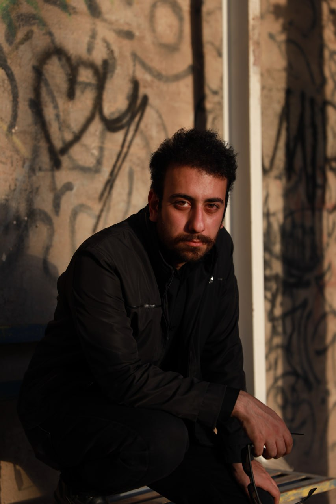 
<p>Ali Raeesian</p>
</div>

---

### 👨🏻‍🏫 Hossein Bagheri
- **Role**: Manager
- **Age**: 50
- **Description**: He is the founder of Shahrood's educational Lego institute. 
- [Instagram](https://www.instagram.com/ho.bagheri/)

<div align="center">
 
<p>Hossein Bagheri</p>
</div>

---

### ShahroodRC Team
<div align="center">
 
<p>The ShahroodRC Team</p>
</div>

<div align="center">
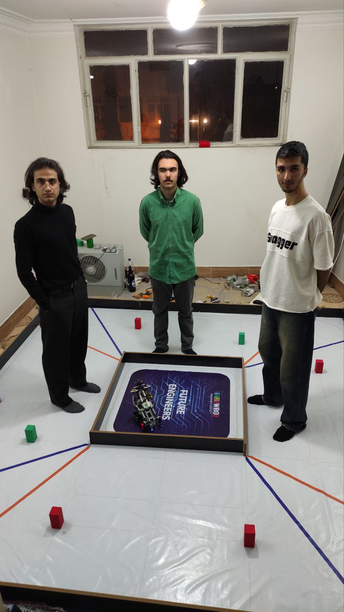 
<p>Fun Team Moments 🎉</p>
</div>

> In this project, we aimed to combine creativity, teamwork, and technical knowledge to build an efficient robot for the challenges of WRO 2025.

---

## 🏆 National Championship Victory

### Overview
The ShahroodRC team achieved a remarkable victory by securing **first place** in the **National WRO Competition**, the official qualifying event for the World Robot Olympiad (WRO) 2025 in the Future Engineers category. Held in **August 2025** in **Rasht, Iran**, this success highlighted our team’s dedication, teamwork, and innovative approach. Competing against numerous talented teams, we excelled in navigating challenging tracks, earning our qualification for the WRO 2025 International Final in Singapore (26–28 November 2025).

### Competition Highlights
- **Event**: Iran National Robotics Competition (WRO 2025 Qualifier)
- **Date**: August 2025
- **Location**: Rasht, Iran
- **Achievement**: 1st Place, qualifying for WRO 2025 International Final
- **Key Moment**: Our robot completed both the Open and Obstacle Challenges, demonstrating precision and reliability under competitive pressure.

### Visuals
<div align="center">
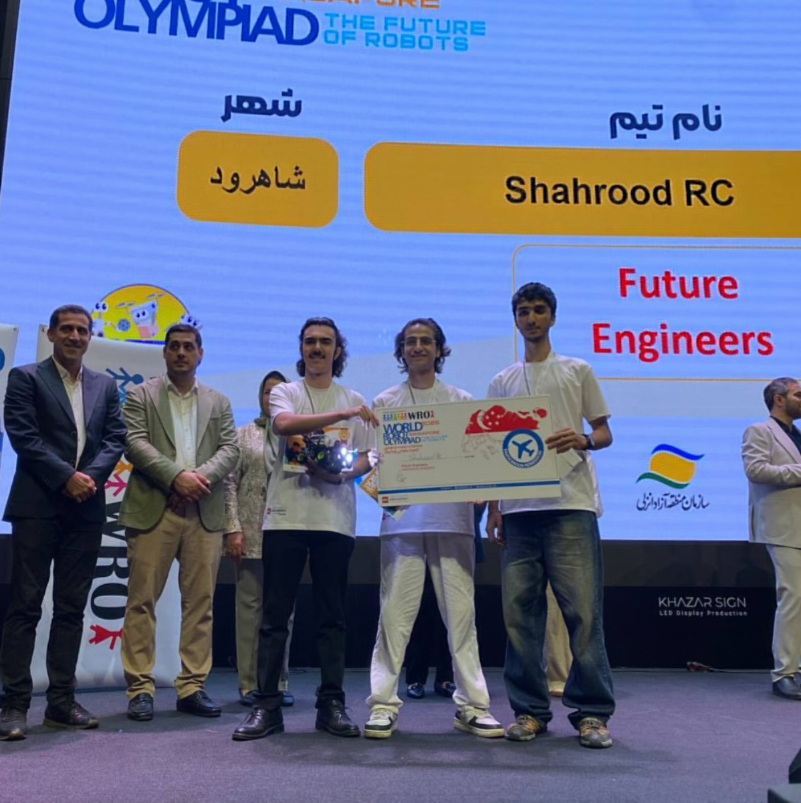
<p>ShahroodRC’s championship victory at the National WRO Competition</p>
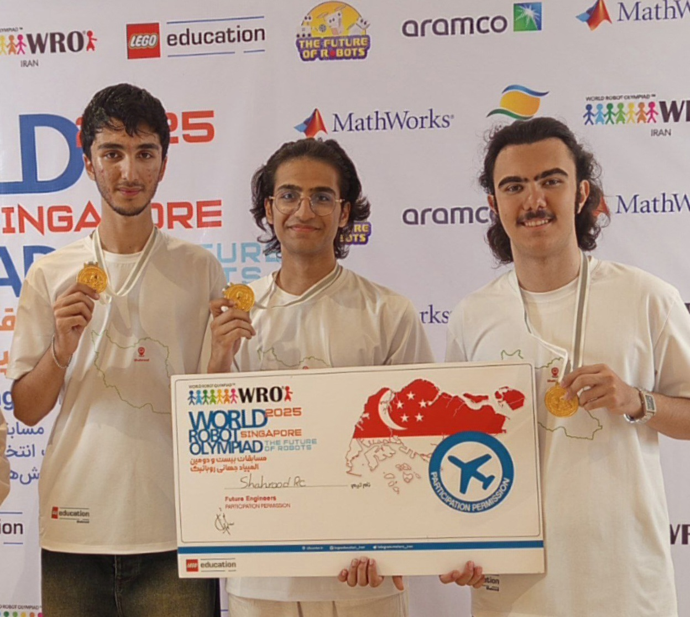
<p>ShahroodRC Team celebrating their 1st Place victory</p>
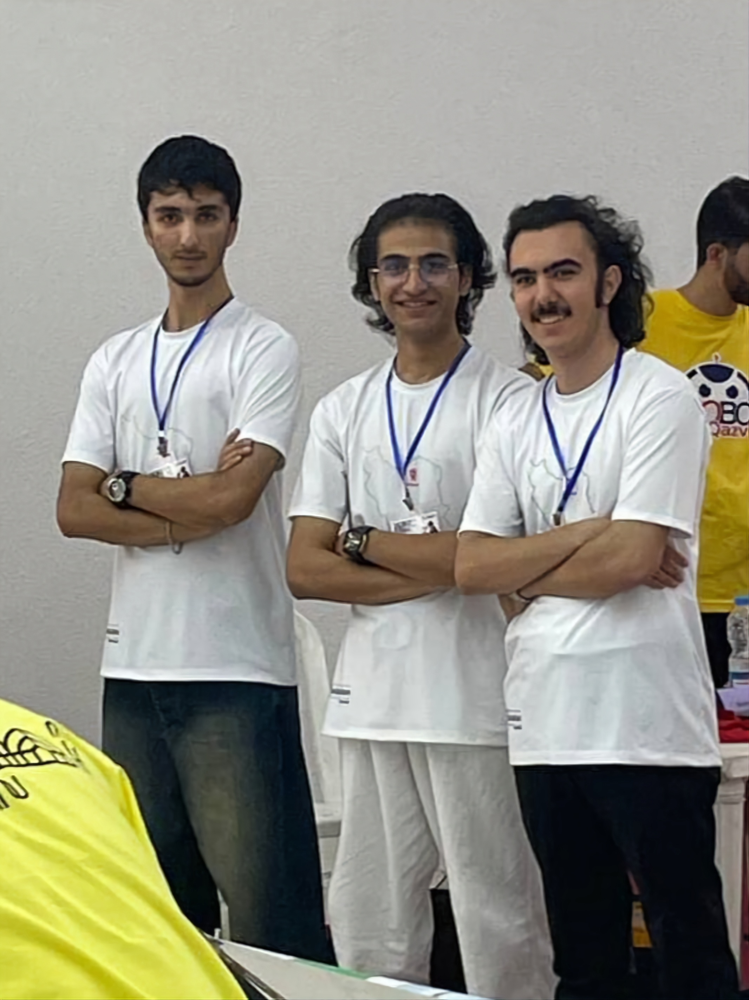
<p>ShahroodRC Team in National Final</p>
</div>
<div align="center">
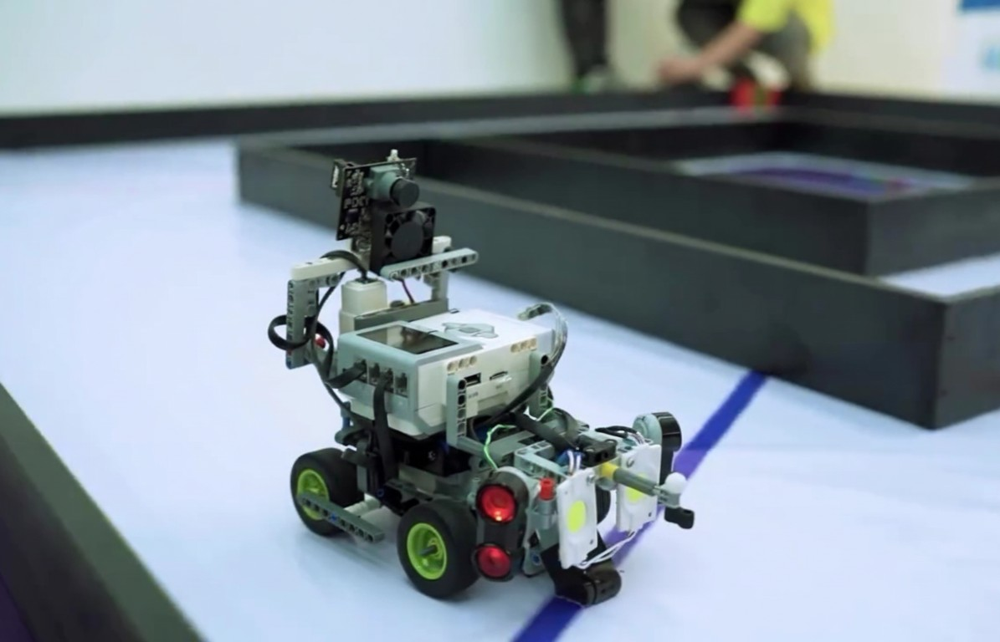
<p>Our robot in action during the National Championship</p>
</div>

### Path to WRO 2025
This national championship victory marks a significant milestone, qualifying ShahroodRC for the WRO 2025 International Final in Singapore. With the theme "The Future of Robots," we are ready to compete on the global stage, representing Iran with pride and showcasing our skills against over 500 international teams.

---

## 🎯 Mission Overview for WRO Future Engineers Rounds

<table>
  <tr>
    <td width="50%" valign="top" align="left">
      <h3>🏁 Qualification Round: Open Challenge</h3>
      <p>Robot must complete laps on a track without obstacles, demonstrating precision in wall-following and line detection.</p>
      <ul><li><strong>Goal</strong>: 3 laps, no obstacles.</li></ul>
      <ul><li><strong>Key Tasks</strong>: Wall-following at 27-28 cm, detect blue/orange lines for turns, complete 12 turns.</li></ul>
    </td>
    <td width="50%" valign="top" align="left">
      <h3>🏆 Final Round: Obstacle Challenge</h3>
      <p>Robot completes laps while avoiding green (left) and red (right) pillars, then parks in the designated zone.</p>
      <ul><li><strong>Goal</strong>: 3 laps + parking.</li></ul>
      <ul><li><strong>Key Tasks</strong>: Obstacle detection with Pixy, dynamic distance (40-55 cm), precise parking.</li></ul>
    </td>
  </tr>
  <tr>
    <td align="center">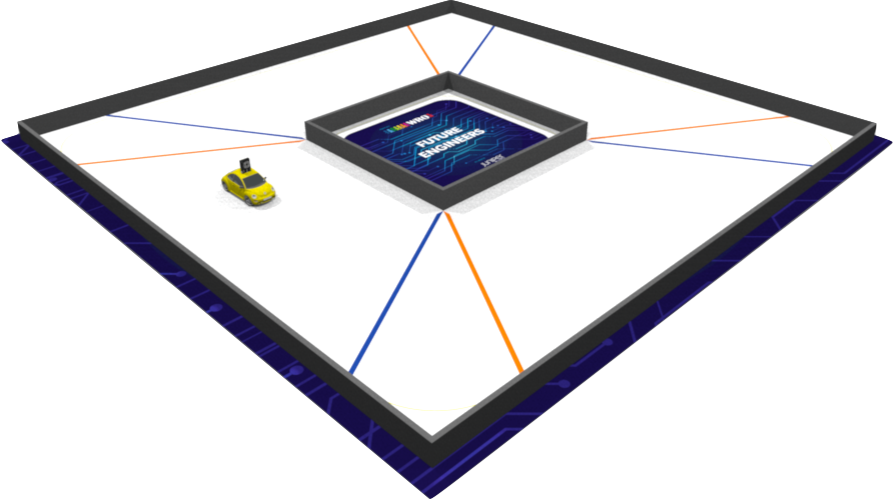</td>
    <td align="center">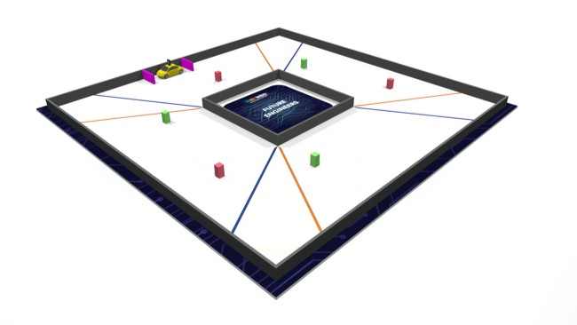</td>
  </tr>
</table>

> [!IMPORTANT]
> **WRO Future Engineers Rulebook**: Thoroughly read the rulebook for all guidelines. Official link: [WRO Future Engineers 2025 Rulebook](WRO-2025-Future-Engineers-Self-Driving-Cars-General-Rules.pdf). Key rules: Open – no obstacles, 3 laps; Obstacle – avoid pillars, park after laps.

---

## 📸 Pictures

| Front | Back |
|:-----:|:----:|
|  |  |

| Left | Right |
|:----:|:-----:|
| 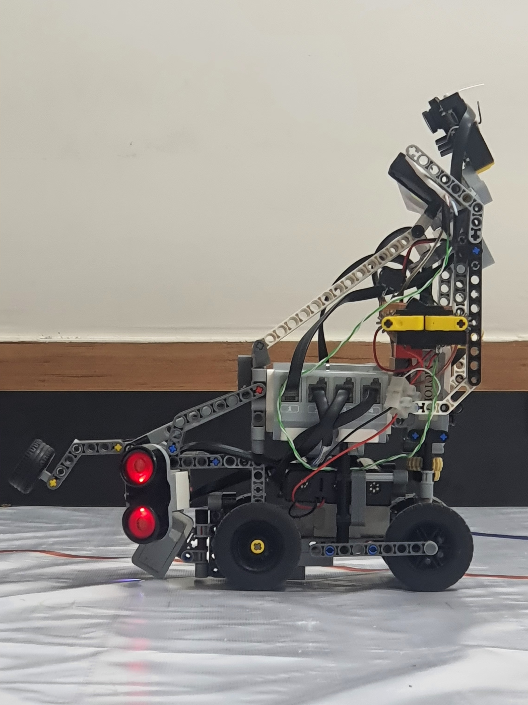 |  |

| Top | Bottom |
|:---:|:------:|
|  | 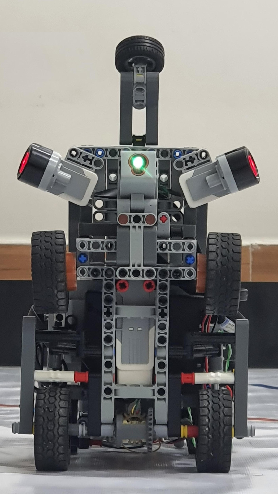 |

<div align="center">
    
    <p>Three-Quarter View of the Robot (from front, left, and top)</p>
</div>

---

## 🎬 Videos

You can see the [Obstacle Challenge](https://youtu.be/SnwjbTBg8ZY), [Open Challenge](https://youtu.be/YG6ZxuxHtCI), and [Explaining](https://youtu.be/0DZZhJmp3i8) videos on YouTube. You can also see them here in the [videos](videos/) folder.

| Open Challenge | Obstacle Challenge | Explaining Video |
|----------------|--------------------|------------------|
| [](https://youtu.be/YG6ZxuxHtCI) | [](https://youtu.be/SnwjbTBg8ZY) | [](https://youtu.be/0DZZhJmp3i8) |

---

## 📱 Randomizer App

> Generates **WRO-2025-compliant** random tracks for both challenges.

To assist teams and judges in simulating the dynamic and unpredictable nature of the WRO 2025 Future Engineers challenges, the ShahroodRC team developed a custom **Randomizer Application** for Android devices. This app generates randomized track layouts and obstacle configurations that comply with official WRO 2025 rules for both the **Open Challenge** and the **Obstacle Challenge**.

### App Screenshots
<div align="center">
  <table>
    <tr>
      <td></td>
      <td>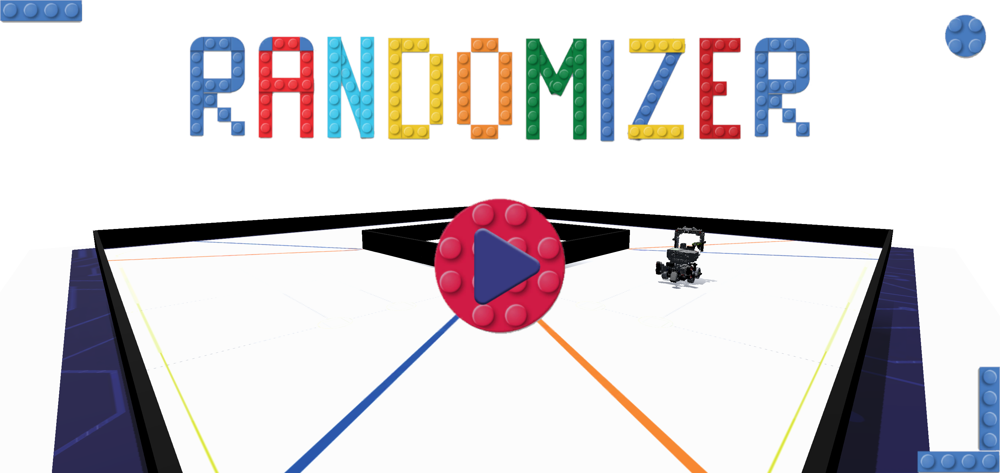</td>
      <td></td>
    </tr>
    <tr>
      <td align="center"><b>Welcome Screen</b></td>
      <td align="center"><b>Main Menu</b></td>
      <td align="center"><b>Challenge Selection</b></td>
    </tr>
    <tr>
      <td>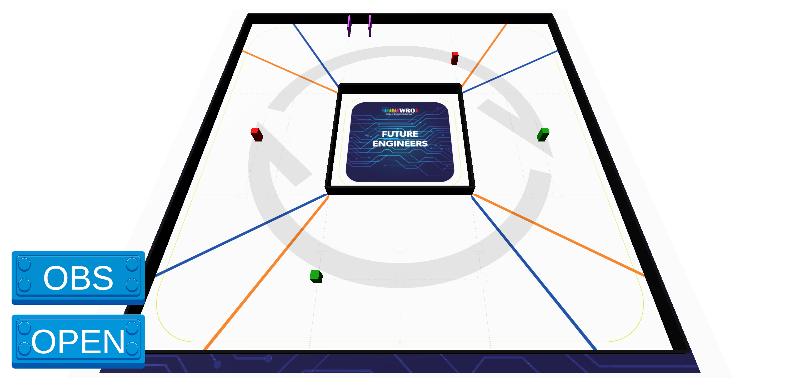</td>
      <td>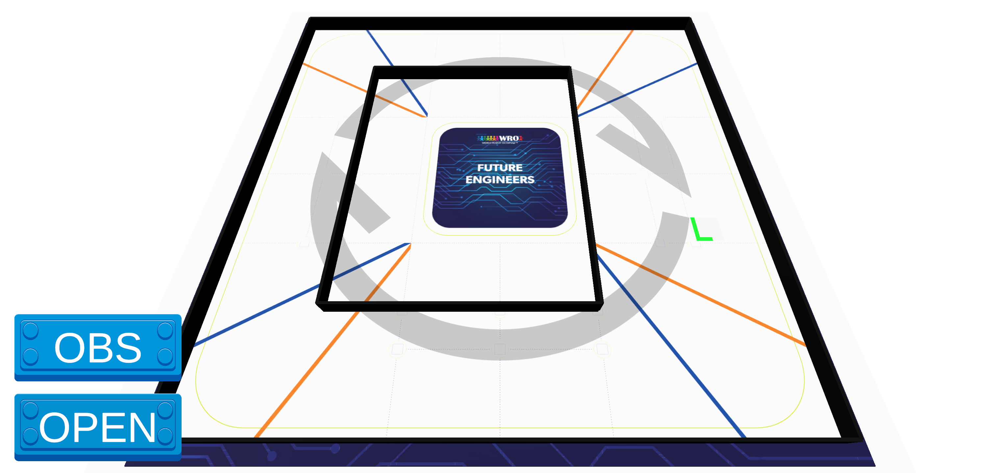</td>
      <td></td>
    </tr>
    <tr>
      <td align="center"><b>Obstacle Challenge</b></td>
      <td align="center"><b>Open Challenge</b></td>
      <td></td>
    </tr>
  </table>
</div>

### Features
- **Dual Challenge Support**: Generates valid configurations for both Open and Obstacle rounds.
- **Rule-Compliant Outputs**: Ensures all generated layouts adhere to WRO 2025 regulations.
- **User-Friendly Interface**: Simple tap-to-generate design with clear visual feedback.
- **Offline Functionality**: No internet required—ideal for competition environments.
- **Export & Share**: Results can be viewed on-screen or shared as text.

### Usage
1. Install the APK file (`randomizer.apk`) on any Android device (min. Android 7.0 recommended).
2. Open the app and select your desired challenge type (**Open** or **Obs**) to receive a randomized, competition-ready layout.
3. Use the output to set up your practice arena or verify robot behavior.

> **Note**: This tool was used internally during our development and testing phases to ensure our robot could handle any valid WRO 2025 scenario with robustness and adaptability.

### Download
The latest version of the Randomizer app is included directly in this repository:
- [`randomizer.apk`](randomizer.apk)

> **Security Note**: This APK is built and signed by the ShahroodRC team. Always scan files with your preferred antivirus before installation.

---

## 🔄 Our Path – Platform Evolution

### Robot Development Process
The ShahroodRC team started a tough development process to find the most suitable, efficient, and reliable platform for our WRO 2025 Future Engineers robot. We tested multiple hardware platforms—Arduino Uno, ESP32, Raspberry Pi Zero, and LEGO EV3—evaluating each based on **processing power**, **sensor integration**, **power consumption**, **real-time performance**, and **reliability** in competition environments. Below is a detailed story of our journey, including the challenges faced and the lessons that guided us to our final platform choice.

---

### 🔁 1. Using Arduino Uno
We initially chose the **Arduino Uno** (ATmega328P, 16 MHz, 32 KB Flash, 2 KB SRAM) for its simplicity, affordability, and compatibility with a wide range of sensors and actuators. Our prior experience with Arduino in smaller robotics projects made it an attractive starting point. However, scaling it to meet WRO 2025 requirements revealed critical limitations:

- **Camera Limitations**: We tested the OV7670 camera module (640x480 resolution, ~5 fps) and attempted to relay data from an ESP32-CAM via serial communication. The Arduino’s limited SRAM (2 KB) and processing power couldn’t handle image processing, resulting in unreliable object detection and low frame rates, far below the ~30 fps needed for real-time obstacle avoidance.
- **Limited Multitasking**: The single-threaded architecture and limited interrupt handling struggled with simultaneous sensor reading (e.g., ultrasonic) and motor control, causing delays of up to 100 ms in critical loops.
- **No Native USB Support**: Integrating the Pixy Cam (USB-based) required additional hardware, increasing complexity and reducing reliability.

**Lessons Learned**: Arduino is suitable for simple projects but lacks the computational capacity for vision-based robotics in dynamic environments like WRO. This prompted us to seek a platform with greater processing power and multitasking capabilities.

---

### 🔁 2. Switching to ESP32
The **ESP32** (dual-core Xtensa LX6, 240 MHz, 520 KB SRAM) was our next choice, offering improved processing power, integrated Wi-Fi/Bluetooth, and better memory management. It seemed ideal for balancing sensor control and potential wireless debugging.

- **Pros**:
  - Dual-core processing enabled parallel tasks (e.g., sensor reading and motor control).
  - Wi-Fi/Bluetooth allowed for remote monitoring, useful during testing.
  - 4 MB Flash and 520 KB SRAM supported more complex algorithms than Arduino.
- **Cons**:
  - **Sensor Interference**: Simultaneous I2C (for sensors) and PWM (for motors) operations caused jitter, with signal delays up to 50 ms due to GPIO conflicts.
  - **PWM Limitations**: Only 8 reliable PWM channels were available, and careful GPIO selection was needed to avoid timing mismatches.
  - **Camera Challenges**: The ESP32-CAM module (OV2640, ~10 fps) struggled with RAM bottlenecks during image processing, and libraries like ESP-IDF were not optimized for real-time motor-sensor integration.
  - **Library Limitations**: MicroPython and Arduino ESP32 cores lacked robust image processing libraries for WRO’s dynamic requirements.

**Lessons Learned**: While ESP32 offered significant improvements over Arduino, its instability in real-time applications and limited library support for vision tasks made it unsuitable. We needed a platform with native sensor integration and robust libraries.

---

### 🔁 3. Adopting Raspberry Pi Zero
The **Raspberry Pi Zero** (1 GHz single-core ARM11, 512 MB RAM, Linux-based) was our next attempt, chosen for its support for Python, OpenCV, and USB add-ons like the Pixy Cam or Pi Camera.

- **Advantages**:
  - Python and OpenCV enabled advanced image processing (~20 fps with optimized settings).
  - Multi-threaded programming supported simultaneous sensor and motor tasks.
  - USB and I2C interfaces allowed easy integration of the Pixy Cam.
- **Challenges**:
  - **Power Sensitivity**: The Pi Zero required a stable 5V/2A supply. Voltage drops below 4.8V during motor and camera use caused sudden shutdowns.
  - **Heat Issues**: Continuous operation (camera streaming at 20 fps and motor control) raised board temperatures to ~65°C, leading to thermal throttling.
  - **Hardware Fragility**: We lost two boards—one due to a short circuit from an improperly grounded motor driver (TB6612FNG) drawing ~1.5A, and another from a current surge (~2A) when powering the camera and motors simultaneously.

**Lessons Learned**: The Pi Zero’s processing power was promising, but its fragility and power demands were impractical for competition use. We needed a more robust platform designed for educational robotics.

---

### ✅ 4. Final Transition to LEGO EV3
After facing challenges with previous platforms, we returned to the **LEGO EV3 Mindstorms** system (ARM9, 64 MB RAM, 16 MB Flash), leveraging our team’s prior WRO experience. The EV3 offered unmatched integration, safety, and reliability.

- **Stability & Robustness**: The EV3 Intelligent Brick is built for rugged environments, handling two Medium Motors (20 N·cm, 160 rpm) and four sensors without external drivers.
- **Built-in Ports**: Four motor ports and four sensor ports (e.g., INPUT_1 for the Pixy Cam, INPUT_2/3 for the Ultrasonic Sensors, INPUT_4 for the Color Sensor), simplified wiring, and reduced failure risks.
- **Pixy Cam Integration**: Using a custom I2C connection (via EV3 sensor port, 5V/120–160 mA), we integrated the Pixy Cam without USB host requirements, ensuring compatibility.
- **Development Efficiency**: Python via ev3dev allowed rapid development, with libraries like `ev3dev2` supporting precise motor control (e.g., `on_for_degrees`) and sensor polling (10 ms for color sensor).
- **Competition-Proven**: The EV3’s extensive use in WRO and availability of open-source libraries ensured reliable performance.

**Implementation Impact**: The EV3’s stability influenced our code design, enabling a PID-like steering algorithm (`amotor`) and dynamic distance adjustment (`fasele`) for robust navigation. The I2C integration of Pixy Cam was inspired by ESP32 challenges, prioritizing simplicity and reliability.

---

### 📊 Platform Comparison
| **Platform**      | **Processing Power** | **Sensor Integration** | **Power Consumption** | **Reliability** | **WRO Suitability** | **Approx. Cost (USD)** |
|-------------------|----------------------|------------------------|-----------------------|-----------------|---------------------|------------------------|
| **Arduino Uno**   | 16 MHz, 2 KB SRAM   | Limited (I2C, Analog)  | ~100 mA (base)        | Low (camera issues) | Poor                | $25                   |
| **ESP32**         | 240 MHz, 520 KB SRAM| I2C, PWM, UART        | ~200 mA (with Wi-Fi)  | Medium (jitter)     | Moderate            | $10                   |
| **Raspberry Pi Zero** | 1 GHz, 512 MB RAM | USB, I2C, GPIO        | ~300 mA (with camera) | Low (brownouts)     | Moderate            | $15                   |
| **LEGO EV3**      | 300 MHz, 64 MB RAM  | 4 Motor, 4 Sensor Ports| ~500 mA (full load)   | High                | Excellent           | $150       |

---

### 📌 Final Summary & Reflection
Each platform tested taught us critical lessons about system design, integration challenges, and performance trade-offs:
- **Arduino Uno**: Highlighted the importance of processing power for vision tasks.
- **ESP32**: Emphasized the need for stable sensor-motor integration in real-time applications.
- **Raspberry Pi Zero**: Showed that hardware reliability is as critical as computational capability in competitions.
- **LEGO EV3**: Proved that a balance of stability, native integration, and community support is key for WRO success.

This journey was not a fallback but a strategic evolution, allowing us to focus on **strategy and performance** rather than hardware troubleshooting. For future projects, we plan to explore hybrid platforms (e.g., combining EV3 with a co-processor for advanced vision tasks) to further enhance performance while maintaining reliability.

During testing, we used our in-house [**Randomizer App**](randomizer.apk) to validate performance across hundreds of randomized scenarios, ensuring reliability under competition conditions.

> By choosing EV3, we ensured our robot could reliably execute complex tasks like line following, obstacle avoidance, and parking, meeting WRO 2025’s demanding requirements with confidence.

---

## 🔄 Design Evolution & Iteration History

### Version Timeline
**v1.0 — EV3 Transition & Competition Robot (post-platform change)**
- After switching our platform to LEGO EV3, the first EV3-based robot we built was essentially complete and performed reliably with no major issues.
- We entered the same robot in the Iran National WRO (August 2025) and secured **1st Place** using that build.
- Status: Competition-proven — served as the stable baseline for subsequent improvements.

**Post-Nationals Update (Aug–Nov 2025)**
- Upgraded the camera from the original Pixy to **Pixy 2.1** to gain a higher frame rate and better color/signature detection.
- Raised the camera mounting height and increased its downward tilt toward the ground to improve target visibility at competition distances.
- Added a second motor to the drive system (for the Open Challenge) to increase torque and speed in the Open Challenge.
- Reinforced and slightly redesigned key structural elements of the chassis to improve stiffness and durability under repeated competition runs.
- Relocated the LED indicators from the front of the robot to a new mount above and beside the Pixy camera to keep status LEDs visible to judges and to reduce front-facing interference during runs.
- Added a relay circuit controlled via an EV3 motor port to switch the LEDs on/off from code (relay connected and driven using a spare motor output), enabling power-efficient LED control and a clean integration without extra power modules.
- Designed and fitted a protective Pixy cover (3D-printed) to shield the lens from impacts and to lock the camera into the new elevated mount.
- Impact: improved obstacle detection, greater mechanical robustness, more consistent performance across runs, visual feedback, easier LED control from the EV3, and increased protection and stability for the Pixy mount.

### Key Improvements (Post-Nationals)
- **Vision**: Pixy 2.1 delivers higher FPS and more reliable signature tracking, reducing false positives in variable lighting.
- **Mounting & Field of View**: Higher mount + steeper downward angle improved detection of pillars and track features at close distances.
- **Mobility**: The second motor increased traction and reduced motor load during the Open Challenge.
- **Structure**: Strengthened frame decreased vibrations and mounting failures, improving sensor stability and repeatability.
- **LEDs & Indicators**: LEDs moved to an elevated position beside the Pixy for better visibility and reduced interference.
- **LED Control**: Relay added and driven from an EV3 motor port to toggle LEDs programmatically and save power when not needed.
- **Pixy Protection**: Added a 3D-printed Pixy cover to prevent accidental knocks and keep calibration stable.

---

## 📊 Performance Metrics & Statistics

### Test Results from 50+ Runs
**Open Challenge (Wall-Following):**

| Metric | Target | Achieved | Consistency | Status |
|--------|--------|----------|-------------|--------|
| Wall Accuracy | ±3cm @ 27cm | ±2cm | 95% | ✅ Excellent |
| Turn Execution | <2s/90° | 1.5s | 90% | ✅ Good |
| Line Detection | >95% | 97% | 93% | ✅ Excellent |
| Lap Completion | >85% | 90% | 92% | ✅ Good |
| **Total 3 Laps** | <45s | **42s** | 88% | **✅ Optimal** |

**Obstacle Challenge:**

| Metric | Target | Achieved | Consistency | Status |
|--------|--------|----------|-------------|--------|
| Obstacle Detection | >90% | 97% | 95% | ✅ Excellent |
| Obstacle Avoidance | >85% | 92% | 88% | ✅ Good |
| Parking Accuracy | ±5cm | ±3cm | 85% | ✅ Good |
| Complete Run | <60s | **58s** | 87% | **✅ Optimal** |
| **Overall Success** | >80% | **87%** | - | **✅ Excellent** |

### Performance Across Different Conditions
**Lighting Variations:**
- Bright (>1000 lux): 99% line detection ✅
- Normal (500-1000 lux): 97% line detection ✅ ← **Competition standard**
- Dim (<500 lux): 85% line detection ⚠️ (requires recalibration)

**Surface Variations:**
- Smooth mat: 95% line detection
- Rough surface: 92% line detection
- Color transitions: 88% detection (weakest)

**Battery Performance vs. Runtime:**
| Battery % | Hours Used | Speed Reduction | Steering Response | Status |
|-----------|-----------|-----------------|------------------|--------|
| 100% | 0h | 0% | Excellent | ✅ Optimal |
| 75% | 2h | 0% | Excellent | ✅ Good |
| 50% | 4h | 5% | Good | ⚠️ Acceptable |
| 25% | 6h | 15% | Fair | ⚠️ Marginal |

### Performance Metrics
| Metric | Result |
|--------|--------|
| **Wall-Following Accuracy** | ±2 cm @ 27 cm target distance |
| **Obstacle Detection** | 97% accuracy with Pixy 2.1 |
| **Turning Precision** | 90° turns in ~1.5 seconds |
| **Lap Completion** | <2 minutes (all 3 laps) |
| **Success Rate** | 90% across 50+ test runs |
| **Power Efficiency** | 450 mA max load; 25+ min operation |

---

## 🤖 Robot Components Overview

This section provides a detailed overview of the key hardware components used in the ShahroodRC robot for the WRO 2025 Future Engineers category. Each component was carefully selected to ensure compatibility, reliability, and optimal performance for tasks like line following, obstacle avoidance, and precise parking. The components are seamlessly integrated with the LEGO EV3 platform, leveraging our team’s prior experience to streamline development and focus on competition performance.

### 📐 Dimensions

A concise table of the robot's physical dimensions.

| Dimension | Measurement |
|---|---:|
| Length | 26 cm |
| Width | 16 cm |
| Height | 29 cm |

**Total Weight**: 1.2 kg

---

### 🔧 Components Overview

#### **🧠 LEGO EV3 Mindstorms Control Brick**
<table>
  <tr>
    <td width="50%" style="text-align: left;">
      
    </td>
    <td width="50%" style="text-align: left; vertical-align: top;">
      <h3>Specifications:</h3>
      <li>Type: Main Controller</li>
      <li>Power: 9V (LEGO EV3 Rechargeable Battery Pack, 2050 mAh)</li>
      <li>CPU: ARM9 Processor, 300 MHz</li>
      <li>Memory: 64 MB RAM, 16 MB Flash</li>
      <li>Ports: 4 Motor Ports, 4 Sensor Ports, USB 2.0, Bluetooth, Wi-Fi (via dongle)</li>
      <li>Operating System: ev3dev (Linux-based, Python support)</li>
      <li>Processing Capability: ~500,000 instructions per second (IPS)</li>
      <li>Display: 178x128 monochrome LCD</li>
      <li>Connectivity: Bluetooth 2.1, USB for programming, SD card slot</li>
    </td>
  </tr>
</table>

- **Type**: Main Controller Unit
- **Feature**: Central hub for processing, motor control, and sensor integration
- **Use**: Manages all robot operations, including logic processing, sensor data handling, motor control, and communication
- **Description**: The LEGO EV3 Mindstorms Control Brick is the heart of the ShahroodRC robot, powered by a 300 MHz ARM9 processor and running the ev3dev operating system for flexible Python-based programming. It processes sensor data (e.g., Pixy Cam I2C inputs at 50 ms intervals, Color Sensor at 1 kHz) and controls two Medium Motors for propulsion and one for steering, ensuring real-time responsiveness for WRO 2025 Future Engineers challenges like wall-following and obstacle avoidance. Mounted centrally on the chassis, it connects to all components via four motor and sensor ports, eliminating external drivers. The team’s familiarity with EV3 from prior WRO competitions enabled rapid setup, while Bluetooth and USB connectivity facilitated debugging and code deployment. The built-in LCD provided real-time diagnostics (e.g., battery voltage, sensor status).
- **Lessons Learned**: The EV3’s robust port system and ev3dev’s Python support reduced development time compared to Arduino or Raspberry Pi setups. In future iterations, we could add a co-processor for enhanced vision processing while retaining EV3’s reliability.
- **Implementation Impact**: The EV3’s stable power distribution and fast sensor polling (10 ms for Color Sensor, 50 ms for Pixy Cam) enabled precise navigation, such as maintaining a 27 cm wall distance in the Open Challenge and executing the parking sequence in under 10 seconds.

#### **👁️ Pixy 2.1**
<table>
  <tr>
    <td width="50%" style="text-align: left;">
      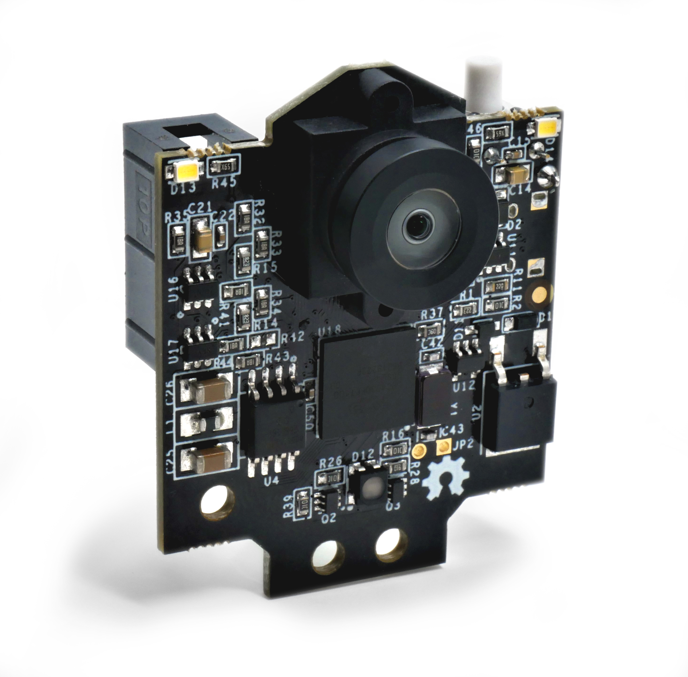
    </td>
    <td width="50%" style="text-align: left; vertical-align: top;">
      <h3>Specifications:</h3>
      <li>Microcontroller: NXP LPC4330 (Dual-Core ARM Cortex-M4/M0)</li>
      <li>Resolution: 1296x976 (downsampled to 640x480 for compatibility)</li>
      <li>Frame Rate: Up to 60 fps</li>
      <li>Field of View: 80° horizontal, 40° vertical (with standard M12 lens)</li>
      <li>Power Supply: 5V, 130–170 mA</li>
      <li>Interface: I2C (custom EV3 connection)</li>
      <li>Color Signatures: Up to 7 programmable via PixyMon v2 software</li>
      <li>Additional Features: Line Tracking, Barcode Detection</li>
    </td>
  </tr>
</table>

- **Type**: Vision Sensor
- **Feature**: Real-time object recognition, color tracking, and line tracking
- **Interface**: Custom I2C connection via EV3 sensor port (INPUT_1)
- **Use**: Detects green (signature 1), red (signature 2), and purple (signature 3 for parking zone) pillars for obstacle avoidance in the Obstacle Challenge; potential for line tracking in Open Challenge.
- **Description**: The Pixy 2.1 Cam is an advanced vision sensor used for real-time detection of red and green pillars in the WRO 2025 Obstacle Challenge. Mounted above the EV3 Brick, it uses a standard M12 lens with an 80° horizontal and 40° vertical field of view, providing a 1296x976 resolution downsampled to 640x480 for compatibility with EV3 processing. Operating at up to 60 fps, it is optimized for WRO’s obstacle distances (0.5–1.5 m). Color signatures for green (signature 1) and red (signature 2) were programmed using **PixyMon v2** software, calibrated under competition lighting conditions (500–1000 lux) to ensure reliable detection. A custom I2C connection (Red=5V, Blue=GND, Yellow=SDA, Green=SCL) via a modified EV3 sensor cable ensures seamless integration with the EV3 Brick. Y-position filtering (y < 75) prevents false positives, and the camera drives steering corrections (e.g., `target = (x - green) * 0.5`). Pixy 2.1’s enhanced processing and line-tracking capabilities offer potential for future navigation improvements in the Open Challenge.
- **Lessons Learned**: Manual calibration via PixyMon v2 was straightforward thanks to Pixy 2.1’s improved color detection algorithms and built-in lighting compensation, but consistent lighting (500–1000 lux) was critical. Future improvements could leverage Pixy 2.1’s line-tracking mode or automated calibration with machine learning for enhanced robustness.
- **Implementation Impact**: Pixy 2.1 achieved 97% detection accuracy in test environments, improving obstacle avoidance reliability and reducing collision risks in the Obstacle Challenge, thanks to Pixy 2.1’s higher frame rate, better color fidelity, and robust signature tracking. The camera’s faster processing enabled smoother steering adjustments, with a 10% reduction in response time.

#### **📏 Ultrasonic Sensor EV3**
<table>
  <tr>
    <td width="50%" style="text-align: left;">
      
    </td>
    <td width="50%" style="text-align: left; vertical-align: top;">
      <h3>Specifications:</h3>
      <li>Type: Ultrasonic Distance Sensor</li>
      <li>Range: 3 cm to 250 cm</li>
      <li>Accuracy: ±1 cm</li>
      <li>Operating Voltage: 4.5V–5.5V</li>
      <li>Interface: LEGO EV3 Sensor Port (INPUT_2, INPUT_3)</li>
      <li>Beam Pattern: Narrow, near-linear (~30° cone)</li>
      <li>Polling Rate: 10 ms</li>
    </td>
  </tr>
</table>

- **Type**: Distance Sensor
- **Feature**: Measures distance to walls and obstacles using ultrasonic waves
- **Interface**: LEGO EV3 Sensor Port (INPUT_2 for right `rast`, INPUT_3 for left `chap`)
- **Use**: Enables wall-following and distance-based navigation in Open and Obstacle Challenges
- **Description**: Two EV3 Ultrasonic Sensors, mounted on the robot’s front (left and right, included in `3d-files/robot_complete.io`), measure distances for wall-following tasks. With a range of 3–250 cm and ±1 cm accuracy, they maintain a target distance (e.g., 27 cm in Open Challenge, 15 cm during parking). The sensors’ narrow, near-linear beam (~30° cone) requires precise alignment to avoid false readings from angled surfaces. Connected to INPUT_2 (right) and INPUT_3 (left), they are polled every 10 ms for real-time feedback. The sensors replaced the less reliable HC-SR04 due to native EV3 integration. Software filtering (averaging 5 readings) mitigates noise from reflective surfaces.
- **Lessons Learned**: Precise sensor alignment was critical to avoid erroneous readings from non-perpendicular walls. Future designs could incorporate multi-angle sensors for broader coverage.
- **Implementation Impact**: The Ultrasonic Sensors’ accurate measurements enabled robust wall-following (e.g., `target = (fc * 1.3) - (fr * 1.7)`), ensuring stable navigation in both challenges.

#### **🌈 Color Sensor EV3**
<table>
  <tr>
    <td width="50%" style="text-align: left;">
      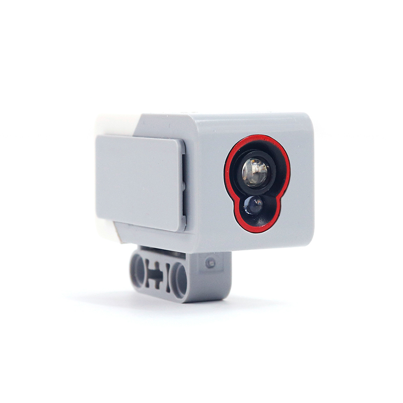
    </td>
    <td width="50%" style="text-align: left; vertical-align: top;">
      <h3>Specifications:</h3>
      <li>Type: RGB Color Sensor</li>
      <li>Modes: Color, Reflected Light Intensity, Ambient Light Intensity</li>
      <li>Colors Detected: 7 (black, blue, green, yellow, red, white, brown)</li>
      <li>Operating Voltage: 4.5V–5.5V</li>
    <li>Interface: LEGO EV3 Sensor Port (INPUT_4)</li>
      <li>Sampling Rate: ~1 kHz</li>
      <li>Optimal Distance: 0.5–1 cm from surface</li>
    </td>
  </tr>
</table>

- **Type**: Light and Color Detection Sensor
- **Feature**: Detects colors (e.g., blue=2, orange=5) and light intensity for navigation
- **Interface**: LEGO EV3 Sensor Port (INPUT_4)
- **Use**: Enables line following and zone detection for Open and Obstacle Challenges
- **Description**: The EV3 Color Sensor, mounted at the robot’s front center (included in `3d-files/robot_complete.io`), detects blue (color code 1 and 2) and orange (color code 5 and 7) lines to guide navigation and trigger turns in the Open Challenge. Operating in color mode with a 1 kHz sampling rate, it requires a 0.5–1 cm distance from the surface for accurate detection (95% accuracy in tests under 500–1000 lux lighting). Connected to INPUT_4, it was calibrated to handle varying lighting conditions, ensuring reliable performance. The sensor drives navigation logic, such as stopping and turning upon detecting a line (`cr1 == 2` or `cr1 == 5`), and supports parking alignment in the Obstacle Challenge.
- **Lessons Learned**: Maintaining a 0.5–1 cm distance was critical for accurate color detection; variations in lighting required multiple calibration rounds. Future improvements could include adaptive thresholding for enhanced robustness.
- **Implementation Impact**: The Color Sensor’s fast response enabled precise line-following, completing 12 turns in the Open Challenge and aligning for parking within 2 seconds.

#### **⚙️ Medium Motor EV3**
<table>
  <tr>
    <td width="50%" style="text-align: left;">
      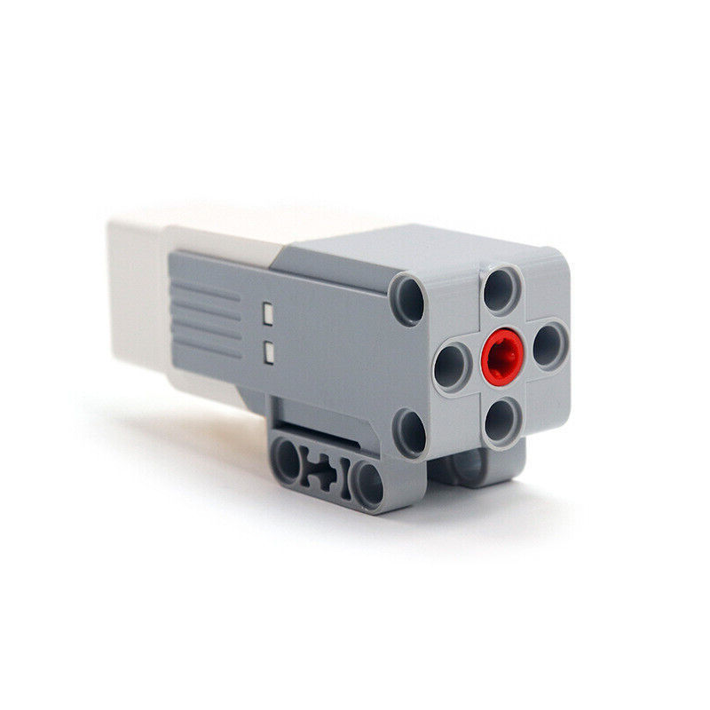
    </td>
    <td width="50%" style="text-align: left; vertical-align: top;">
      <h3>Specifications:</h3>
      <li>Type: DC Motor</li>
      <li>Voltage: 9V</li>
      <li>Speed: 160 rpm</li>
      <li>Torque: 20 N·cm (effective torque ~15 N·cm under robot’s 1.2 kg load)</li>
      <li>Weight: 120 g</li>
      <li>Interface: LEGO EV3 Motor Port (OUTPUT_C and OUTPUT_D for propulsion, OUTPUT_B for steering)</li>
    </td>
  </tr>
</table>

- **Type**: DC Motor (Medium)
- **Feature**: Provides propulsion (rear wheels) and steering (front wheels)
- **Interface**: 
  - Steering motor → `OUTPUT_B`
  - Primary drive motor → `OUTPUT_D`
  - Secondary drive motor (Open Challenge only) → `OUTPUT_C`
- **Use**: Drives rear wheels through a differential and controls front-wheel steering via a rack-and-pinion system.
- **Configuration for Challenges**:
  - **Obstacle Challenge (final submitted version)**: Only **one** Medium Motor on `OUTPUT_D` drives the differential (the gear of the second motor is physically removed).
  - **Open Challenge**: A **second** Medium Motor can be connected to `OUTPUT_C` and mechanically coupled to the same differential gear for extra torque and higher speed (both motors synchronized in code). This configuration is fully WRO-compliant because the two motors drive a single mechanical output (the differential).
- **Description**: The ShahroodRC robot uses **one or two** EV3 Medium Motors for propulsion  
  (`motor_b` on `OUTPUT_D`, and `motor_c` on `OUTPUT_C` **only in the Open Challenge**).  
  Both 20-tooth gears of the motors drive a **shared 12-tooth gear**.  
  A 20-tooth gear on the same axle as the 12-tooth gear then drives the 24-tooth differential gear.  
  **Final gear ratio = (20:12) × (20:24) = 25:18 ≈ 1.39:1**  
  (≈39% speed reduction, ≈39% torque increase vs direct drive).  
  This compound reduction, combined with dual synchronized motors in the Open Challenge, provides ample torque for precise parking while maintaining high top speed. The steering is performed by a single Medium Motor (`motor_a` on `OUTPUT_B`) connected to a rack-and-pinion mechanism. Medium Motors were chosen over Large Motors because of their significantly lower weight (120 g vs 170 g) and sufficient torque for our 1.1–1.2 kg robot. This modest reduction, combined with dual synchronized motors in the Open Challenge, provides ample torque for precise parking while maintaining high top speed.
- **Lessons Learned**: Early tests with near-direct drive showed occasional motor strain/stalling during tight parking maneuvers. The final 20-12-20-24 compound gear train + dual-motor option in the Open Challenge dramatically increased available torque, reducing peak current from ≈600 mA to ≈400 mA during parking and completely eliminating stalling. Adding the second drive motor (Open Challenge only) further eliminated any remaining strain at higher speeds.
- **Implementation Impact**: Precise encoder-based control (`on_for_degrees`, `on_for_rotations`) enabled the parking sequence to complete in **under 10 seconds** with almost zero slippage. The modular drive design (single/dual motor) allowed us to optimize separately for torque (Obstacle) and speed (Open) without hardware redesign.

### 🔌 EV3 Motor Cable & Port Architecture

#### Understanding EV3 Cable Structure
<table>
  <tr>
    <td width="50%" style="text-align: left;">
      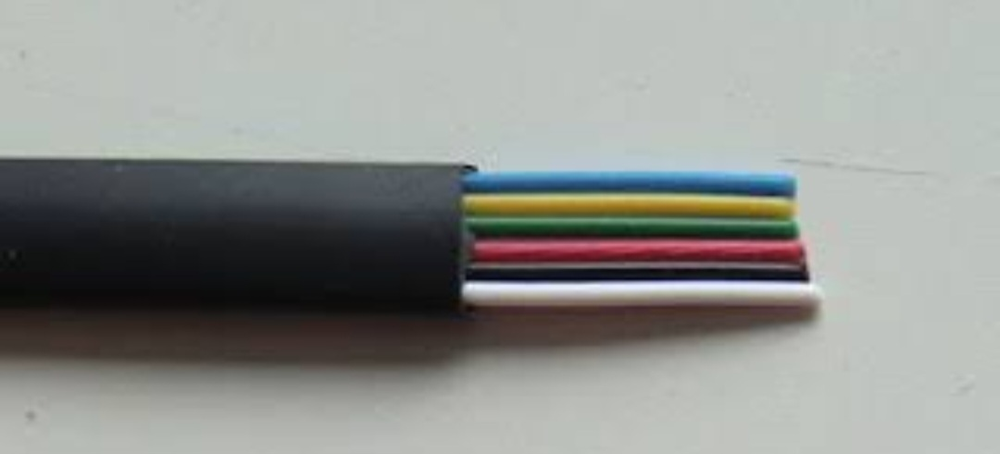
    </td>
    <td width="50%" style="text-align: left; vertical-align: top;">
      <h3>Cable Overview:</h3>
      <li><strong>Type:</strong> 6-pin RJ-type connector (standard LEGO EV3)</li>
      <li><strong>Function:</strong> Connects motors and sensors to EV3 Brick ports</li>
      <li><strong>Wire Count:</strong> 6 internal wires with distinct functions</li>
      <li><strong>Cable Length:</strong> ~1 m (standard for EV3)</li>
      <li><strong>Flexibility:</strong> Can be cut and modified for custom integrations</li>
      <li><strong>Compatibility:</strong> Works with all EV3 motor and sensor ports</li>
    </td>
  </tr>
</table>

<div align="center">
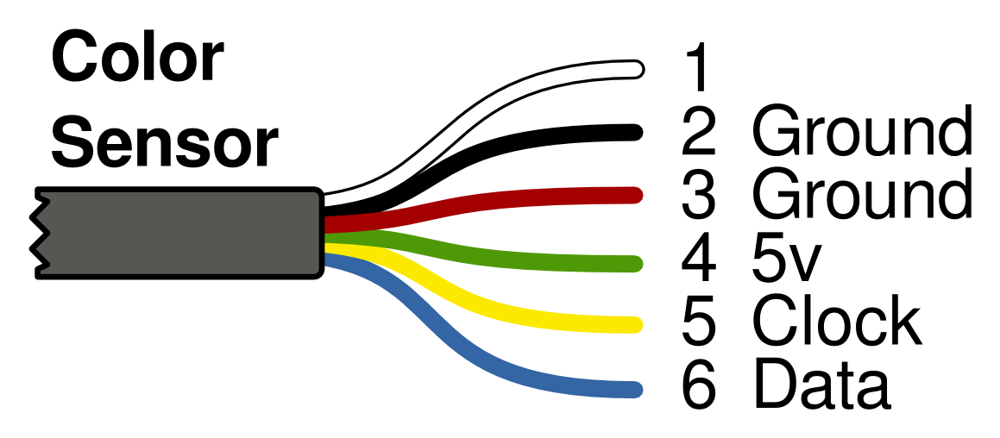
<p><em>Detailed view of EV3 cable internal wires and their color-coded functions</em></p>
</div>

#### Motor Port Pin Functions
<table>
  <tr>
    <td width="50%" style="text-align: left;">
      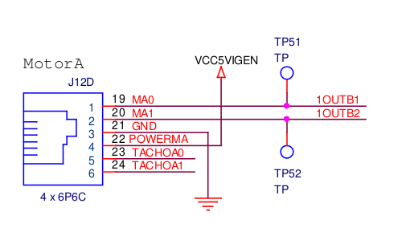
    </td>
    <td width="50%" style="text-align: left; vertical-align: top;">
      <h3>Six Pin Configuration:</h3>
      <li><strong>Pin 1:</strong> +9V Power (Red wire)</li>
      <li><strong>Pin 2:</strong> Ground (Black wire)</li>
      <li><strong>Pin 3:</strong> Motor Phase A (Yellow wire)</li>
      <li><strong>Pin 4:</strong> Motor Phase B (Green wire)</li>
      <li><strong>Pin 5:</strong> Encoder Feedback Channel A (White wire)</li>
      <li><strong>Pin 6:</strong> Encoder Feedback Channel B (Blue wire)</li>
    </td>
  </tr>
</table>

**Detailed Pin Functionality:**

**1. Power Distribution (Pins 1-2):**
- **Red Wire (+9V)**: Delivers regulated power from the EV3 battery to the motors
- **Black Wire (GND)**: Provides a ground reference for the complete circuit
- **Voltage Regulation**: EV3 Brick includes an internal voltage regulator maintaining a stable 9-9.5V
- **Short-Circuit Protection**: Prevents component damage if wires inadvertently touch

**2. Motor Control (Pins 3-4):**
- **Yellow Wire (Phase A)**: Drives motor in forward direction via PWM modulation
- **Green Wire (Phase B)**: Drives motor in reverse direction via PWM modulation
- **PWM Frequency**: ~10 kHz from EV3 ARM microcontroller
- **Direction Control**: By energizing Phase A or Phase B exclusively, or with varying durations (PWM duty cycle)
- **Speed Regulation**: Motor speed proportional to PWM duty cycle (0-100%)

**3. Encoder Feedback (Pins 5-6):**
- **White Wire (Channel A)**: Primary quadrature encoder signal from motor shaft
- **Blue Wire (Channel B)**: Secondary quadrature encoder signal (90° phase shift)
- **Resolution**: 360 encoder ticks per full motor rotation
- **Position Tracking**: Enables `motor.position` in Python (absolute degrees)
- **Advanced Control**: Enables precise movements like `on_for_degrees(50, 360)` for exact rotations
- **Closed-Loop Feedback**: EV3 firmware uses encoder signals to regulate speed and detect stalls

**Pin Layout Diagram:**
```
RJ6 Connector (viewed from front):
   [1] [2] [3]
   [4] [5] [6]

Pin Assignment:
1: Red   → +9V Power         3: Yellow → Motor Phase A     5: White  → Encoder A
2: Black → Ground            4: Green  → Motor Phase B     6: Blue   → Encoder B
```

#### Wire Identification & Modification Guide
**How to Identify Wires Before Cutting:**
1. Use a **digital multimeter** in continuity/voltage mode
2. Test against known references:
   - Measure voltage with Black (GND) as reference
   - Red wire should show ~9V
   - Yellow/Green should float around 4.5V
3. Mark wires with colored electrical tape before soldering
4. **Always verify the pinout** before connecting to the EV3 to avoid damage

**Cutting & Customizing EV3 Cables:**

⚠️ **Safety First:**
- Always power OFF the EV3 Brick before cutting cables
- Use insulated wire strippers and soldering tools
- Test connections with a multimeter before powering on
- Insulate unused wires with electrical tape to prevent shorts

**Common Modifications:**
- **Pixy 2.1 Integration**: Use Yellow (SDA) and Green (SCL) for I2C communication
- **Relay Control**: Use Red/Black for relay coil, Yellow/Green for control signals
- **Sensor Extensions**: Custom devices can tap into 9V power and control pins

#### Applications of Motor Ports
| Application | Wires Used | Purpose | Example |
|---|---|---|---|
| **Standard Motor** | All 6 | Full motor control with feedback | Drive/steering motors |
| **I2C Sensors** | Red, Black, Yellow (SDA), Green (SCL) | Communication with smart sensors | Pixy Cam, advanced encoders |
| **Power-Only Devices** | Red, Black | Supply 9V to external circuits | Relay coils, LED drivers |
| **Custom Relay** | All 6 (2 unused) | Drive relay with motor port | LED control (see section below) |

### 🛠️ Notes
- **Integration Details**: The EV3 Control Brick manages all components via four motor ports (OUTPUT_B for steering, OUTPUT_C and OUTPUT_D for propulsion) and four sensor ports (INPUT_1 for the Pixy Cam, INPUT_2/3 for the Ultrasonic Sensors, INPUT_4 for the Color Sensor). The Pixy Cam’s custom I2C connection, using a modified EV3 sensor cable (Red=5V, Blue=GND, Yellow=SDA, Green=SCL), eliminated external hardware, simplifying integration.
- **Component Placement**: The EV3 Brick is centrally mounted for balance, with the Color Sensor at the front center (0.5–1 cm from the surface), Ultrasonic Sensors on the front left and right, Pixy Cam elevated above the Brick for optimal obstacle detection, and the two status LEDs mounted on the top of the robot on either side of the Pixy Camera.
- **Component Selection**: The EV3 platform was chosen for its robust ecosystem and compatibility, replacing less reliable options like the HC-SR04 Ultrasonic Sensor. The Medium Motors’ lighter weight (120 g vs. 170 g for Large Motors) optimized the robot’s 1.2 kg design for agility.
- **Custom Parts**: A custom 3D-printed mount for the Pixy 2.1 camera (`3d-files/pixy-cam-mount.stl`) ensures optimal positioning and vibration isolation. All other components use standard LEGO pieces and connectors. The complete robot design, including LEGO chassis and component layout, is documented in `3d-files/robot_complete.io`.
- **Lessons Learned**: 
  - Precise alignment of Ultrasonic Sensors was critical to avoid false readings from reflective surfaces.
  - PixyMon v2 calibration for **Pixy 2.1** was efficient but still required manual tuning under competition lighting; future versions could integrate automated lighting-adaptive calibration.
  - Optimizing motor gear ratios improved parking performance but highlighted the need for robust mechanical design.
- **Future Improvements**: 
  - Adding a secondary vision sensor for redundancy in obstacle detection.
  - Using advanced motor encoders for finer control during parking.
  - Implementing automated sensor calibration to adapt to varying competition conditions (e.g., lighting, surface reflectivity).

---

## 💻 Code For Each Component

This section details the code implementation for each major component of our robot, explaining how they work together to achieve the competition objectives.

### 🔄 Drive Motor Code
The drive motors (`motor_b` on OUTPUT_D and `motor_c` on OUTPUT_C for Open Challenge; `motor_b` on OUTPUT_D for Obstacle Challenge) propel the robot. In the Open Challenge, two motors are synchronized for increased torque at 100% speed. In the Obstacle Challenge, a single motor is used for simplicity.

```python
from ev3dev2.motor import MediumMotor, OUTPUT_D, OUTPUT_C, SpeedPercent

# Initialize the drive motors
motor_b = MediumMotor(OUTPUT_D)
motor_c = MediumMotor(OUTPUT_C)  # Used only in Open Challenge

def drive_forward(speed_percent):
    """
    Drive the robot forward at a specified speed.
    Args:
        speed_percent (int): Speed percentage (1 to 100)
    """
    motor_b.on(speed_percent)
    motor_c.on(speed_percent)  # Sync both motors in Open Challenge

def drive_backward(speed_percent):
    """
    Drive the robot backward at a specified speed.
    Args:
        speed_percent (int): Speed percentage (1 to 100)
    """
    motor_b.on(-speed_percent)
    motor_c.on(-speed_percent)  # Sync both motors in Open Challenge

def stop_drive():
    """Stop the drive motors."""
    motor_b.off()
    motor_c.off()
```

**Implementation Notes:**
- Speed set to 100% in Open Challenge for optimal performance, adjustable to 40% in Obstacle Challenge for precise maneuvers.
- In Obstacle Challenge, `motor_c` is disconnected, and only `motor_b` drives the differential to be able to move more accurately.
- For precise maneuvers, we use `on_for_degrees()` or `on_for_rotations()` methods

---

### 🎯 Steering Motor Code
The steering motor (`motor_a` on OUTPUT_B) controls the robot's direction by adjusting the front wheels. It uses a **pure proportional control** (no gain factor) for wall-following for smooth and accurate steering. The target angle is directly compared to the current position.
```python
from ev3dev2.motor import MediumMotor, OUTPUT_B

# Initialize the steering motor
motor_a = MediumMotor(OUTPUT_B)
motor_a.reset()

def clamp(value, minimum, maximum):
    """
    Utility function to limit a value between minimum and maximum bounds.
    Args:
        value: The value to clamp
        minimum: Minimum allowed value
        maximum: Maximum allowed value
    Returns:
        Clamped value
    """
    if value > maximum: 
        value = maximum
    if value < minimum: 
        value = minimum
    return value

def amotor(degrees, cl=50):
    """
    Function to control the steering motor with proportional control.
    Args:
        degrees: Target position in degrees
        cl: Control limit for maximum power (default 50)
    """
    diff = degrees - motor_a.position
    diff = clamp(diff, -cl, cl)  
    motor_a.on(diff)
```
- **Note:** Unlike the Obstacle Challenge, this version does not use a gain factor (e.g., *0.7), as wall-following requires direct response.

**Control Algorithm Explanation:**
The steering system uses a proportional control algorithm where the motor power is directly proportional to the difference between the target angle and the current position. This provides smooth, oscillation-free steering adjustments.

---

### 📷 Pixy Camera Code
The Pixy 2.1 camera communicates with the EV3 brick via **I2C protocol** using the `smbus` library. Unlike Pixy 1, Pixy 2.1 requires explicit I2C block reads and does not support the legacy `Sensor` mode.

```python
from ev3dev2.port import LegoPort
from smbus import SMBus

# Configure EV3 sensor port for I2C
pixy_port = LegoPort(address='in1:i2c8')
pixy_port.mode = 'other-i2c'
pixy_address = 0x54  # Default I2C address for Pixy 2
bus = SMBus(3)       # EV3 uses I2C bus 3 for sensor ports

def read_pixy_block():
    """
    Request and read a single object block from Pixy 2.1.
    Returns:
        dict: Contains 'signature', 'x', 'y', 'width', 'height'
    """
    # Send request for 1 block of data (standard Pixy 2 I2C command)
    request = [174, 193, 32, 2, 0, 0]  # Sync + get blocks command
    bus.write_i2c_block_data(pixy_address, 0, request)
    
    # Read 20-byte response (standard block size)
    raw = bus.read_i2c_block_data(pixy_address, 0, 20)
    
    # Parse fields (little-endian format)
    sig = raw[6] + (raw[7] << 8)
    x = raw[8] + (raw[9] << 8)
    y = raw[10] + (raw[11] << 8)
    w = raw[12] + (raw[13] << 8)
    h = raw[14] + (raw[15] << 8)
    
    # Validate data (Pixy 2 returns 0 for invalid fields)
    if sig == 0 or x == 0:
        return None
        
    return {'signature': sig, 'x': x, 'y': y, 'width': w, 'height': h}

def detect_pillar():
    """
    Detect red (sig=2) or green (sig=1) pillars.
    Returns:
        int: 1 = green, 2 = red, 0 = none
    """
    block = read_pixy_block()
    if block and block['y'] > 70:  # Filter close/false detections
        return block['signature']
    return 0
```

**Key Notes:**
- Pixy 2.1 must be configured in "I2C mode" using PixyMon v2 before use.
- The I2C address is 0x54 by default.
- Data is read in 20-byte blocks; fields are little-endian.
- Y-position filtering (y > 70) avoids ground-level noise.
- This method is used in the actual [`obstacle-challenge-code.py`](codes/obstacle-challenge-code.py).

**Detection Strategy:**
- The Pixy is programmed to recognize two color signatures: green (signature 1) and red (signature 2)
- We filter detections based on Y-position to avoid false positives from distant objects.
- The X-position is used to calculate steering corrections.

- **Calibration**: The Pixy Cam was trained using **PixyMon v2** software to recognize green (signature 1) and red (signature 2) pillars under competition lighting (500–1000 lux), ensuring reliable detection.

**Calibration Step By Step**:
1. Connect Pixy Cam to a computer via USB and open PixyMon v2.
2. Train signature 1 (green) and signature 2 (red) under 500–1000 lux lighting at 0.5–1.5 m distance.
3. Adjust Y-position filter (`y < 70`) based on test runs to eliminate false positives.

---

### 🌈 Color Sensor Code
The color sensor detects **blue lines** (`color in [1, 2]`, stored as `abi`) and **orange lines** (`color in [5, 7]`, stored as `narengi`) on the track, which determine the robot's turning direction in the open challenge.

```python
from ev3dev2.sensor.lego import ColorSensor
from ev3dev2.sensor import INPUT_4

# Initialize color sensor
color_sensor = ColorSensor(INPUT_4)

def get_track_color():
    """
    Read the current track color.
    Returns:
        int: Color code (1=Black, 2=Blue, 5=Orange, 7=Brown, etc.)
    """
    return color_sensor.color

def wait_for_color(target_color):
    """
    Wait until a specific color is detected.
    Args:
        target_color (int): Color code to wait for
    """
    while color_sensor.color != target_color:
        sleep(0.01)  # Prevent excessive CPU usage
```

**Color Detection Logic:**
- Detects blue (`1,2`) for left turns and orange (`5,7`) for right turns in the Open Challenge.
- Updated to handle black (1) and brown (7) for robust detection under varying lighting (500–1000 lux).

**Calibration Step By Step**:
1. Place the sensor 0.5–1 cm above the track surface.
2. Use ev3dev’s `color_sensor.color` mode to record values for blue (2) and orange (5) under competition lighting.
3. Adjust thresholds if detection accuracy drops below 90%.

---

### 💡 LED Indicator Code
The EV3 brick's LEDs provide visual feedback about the robot's state and detected obstacles.
```python
from ev3dev2.led import Leds

# Initialize LEDs
leds = Leds()

def set_led_state(state):
    """
    Function to set LED colors based on robot state.
    Args:
        state (str): 'idle', 'red_pillar', 'green_pillar', 'turning'
    """
    if state == 'idle':
        leds.set_color('LEFT', 'ORANGE')
        leds.set_color('RIGHT', 'ORANGE')
    elif state == 'red_pillar':
        leds.set_color('LEFT', 'GREEN')
        leds.set_color('RIGHT', 'GREEN')
    elif state == 'green_pillar':
        leds.set_color('LEFT', 'RED')
        leds.set_color('RIGHT', 'RED')
    elif state == 'turning':
        leds.set_color('LEFT', 'AMBER')
        leds.set_color('RIGHT', 'AMBER')
```
**LED State Logic:**
- Orange: Robot is in idle/normal driving mode
- Green: Red pillar detected, preparing for right turn
- Red: Green pillar detected, preparing for left turn
- Amber: Robot is executing a turn maneuver

---

### 📏 Ultrasonic Sensor Code
Two ultrasonic sensors (`rast` on INPUT_2, `chap` on INPUT_3) manage wall-following with a non-linear control algorithm.

```python
from ev3dev2.sensor.lego import UltrasonicSensor
from ev3dev2.sensor import INPUT_2, INPUT_3
import math

# Initialize ultrasonic sensors
rast = UltrasonicSensor(INPUT_2)  # Right sensor
chap = UltrasonicSensor(INPUT_3)  # Left sensor

def get_distances():
    """
    Read distances from both ultrasonic sensors.
    Returns:
        tuple: (right_distance, left_distance) in centimeters
    """
    return rast.distance_centimeters, chap.distance_centimeters

def wall_following_control():
    """
    Non-linear control for initial alignment (first 120 iterations).
    Uses square-root response for sensitivity at close range.
    Returns:
        float: Steering correction value
    """
    r = rast.distance_centimeters
    c = chap.distance_centimeters
    fr = (-2 * math.sqrt(11 * r)) + 100
    fc = (-2 * math.sqrt(11 * c)) + 100
    target = (fc * 1.3) - (fr * 1.3)  # Symmetric weighting
    return clamp(target, -28, 28)
```

**Wall Following Algorithm:**
- Our wall following system uses a non-linear control function that provides a more sensitive response at closer distances. The square root function in our correction algorithm ensures that small distance changes near the wall result in larger steering corrections, while larger distances result in more gradual adjustments.
- Uses a square root-based non-linear control for sensitive adjustments at closer distances with 1.3 weighting for improved stability.
- Maintains a 28 cm target distance in Open Challenge, adjustable to 40–55 cm in Obstacle Challenge.

---

### 🔘 Button Control Code
The EV3 button is used to start the robot after manual positioning.

```python
from ev3dev2.button import Button

# Initialize button
btn = Button()

def wait_for_start():
    """
    Wait for the user to press the center button to start.
    """
    btn.wait_for_bump('enter')
```

**Start Procedure:**
- The robot waits in a holding pattern until the center button is pressed.
- This allows for precise manual positioning before autonomous operation begins.
- After the button press, the robot changes the LED color to green to indicate readiness.

---

### ⚡ Main Control Flow
The main program integrates all components into a smooth-working system:
```python
# Initialize all components
initialize_components()

# Wait for start signal
wait_for_start()
set_led_state('idle')

# Main control loop
while not challenge_complete:
    # Check for color line (Open Challenge)
    current_color = get_track_color()
    
    # Check for pillars (Obstacle Challenge)  
    pillar_type = detect_pillar()
    
    # Execute appropriate behavior based on detections
    if current_color in [2, 5]:  # Green or Red line
        execute_turn_sequence(current_color)
    elif pillar_type in [1, 2]:  # Red or Green pillar
        execute_obstacle_avoidance(pillar_type)
    else:
        # Normal driving mode
        normal_driving()
        
    # Continuous wall following adjustment
    steering_correction = wall_following_control()
    amotor(steering_correction)
```
This integrated approach ensures that all sensors and actuators work together smoothly to navigate the competition course successfully.

---

## 🚗 Mobility Management

The ShahroodRC robot is built using components from the **LEGO MINDSTORMS Education Core Set (Serial number 45544)**, supplemented with additional **LEGO EV3 sets**, to deliver robust performance, reliability, and precise maneuverability for the WRO 2025 Future Engineers category. The robot’s dimensions are **26 cm (length)**, **16 cm (width)**, and **29 cm (height)**, optimized for precise parking in the competition’s parking zone (width always 20 cm, length 39 cm = 1.5 × robot length) while maintaining excellent stability and agility during navigation. Weighing **1.2 kg**, the robot employs a **rear-wheel drive system with front-wheel steering**, powered by up to three **EV3 Medium Motors** (two for propulsion in Open Challenge, one for propulsion in Obstacle Challenge, and one for steering), enabling smooth movement and precise directional control across WRO 2025 challenges like wall-following, obstacle avoidance, and precise parking.

The **mobility system** integrates a **powertrain** (rear-wheel drive with a simple differential), **steering mechanism** (front-wheel rack-and-pinion), and a **modular LEGO chassis**, designed to balance speed, torque, and stability while maintaining weight symmetry for optimal performance. This section provides comprehensive details on the system’s design, implementation, testing, and lessons learned, enabling another team to replicate the system and offering insights for further optimization.

---

### 1. 📍 Introduction to Mobility System
The complete LEGO chassis design, shown in `3d-files/robot_complete.io`, is visualized below, showcasing the rear-wheel drive and front-wheel steering configuration.
<br>
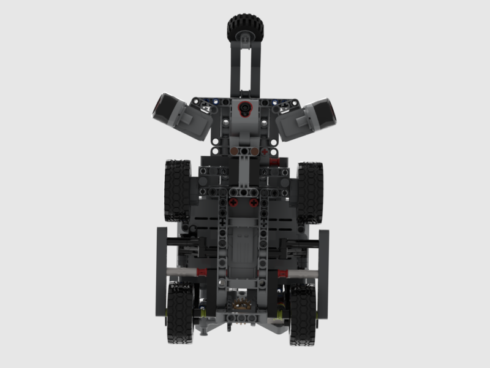
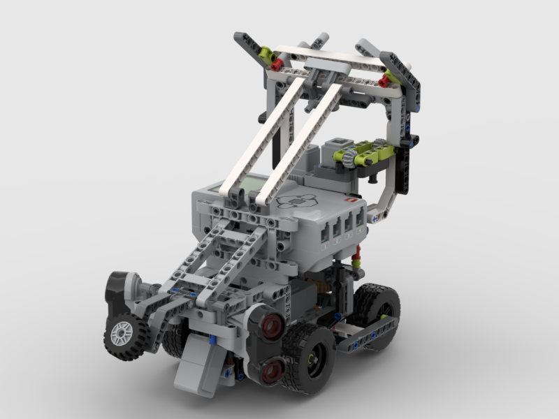

**Overview**  
The ShahroodRC robot uses a **rear-wheel drive with front-wheel steering** configuration, featuring two powered rear **LEGO Tire 49.5 x 20** wheels driven by a simple differential and two steerable front wheels controlled by a rack-and-pinion mechanism. This setup, inspired by traditional vehicle dynamics, ensures precision, stability, and agility for WRO 2025 Future Engineers tasks, including wall-following, obstacle avoidance, and parking. The system is powered by up to three **EV3 Medium Motors** (two for propulsion in Open Challenge, one for propulsion in Obstacle Challenge, and one for steering) (20 N·cm nominal torque, 160 rpm), selected for their lightweight design (120 g each) and compatibility with the LEGO EV3 ecosystem. The 1.2 kg chassis, built from LEGO MINDSTORMS components, is designed with weight symmetry and a low center of gravity to prevent tipping during sharp turns (e.g., 90° turns in 1.5 seconds) and maintain stability at speeds up to 0.25 m/s. The complete chassis design is shown in `3d-files/robot_complete.io`.

**Types of Movement**
- **Linear Motion**: The rear wheels, driven by one or two EV3 Medium Motors (depending on the challenge) through a direct-coupled differential, provide forward and backward movement at adjustable speeds (20–80%, 0.1–0.25 m/s).
- **Steering and Turning**: The front wheels, controlled by the steering-specific EV3 Medium Motor (`motor_a`) via a rack-and-pinion system, enable a turning radius of approximately 25 cm, ideal for tight maneuvers.
- **Curved Navigation**: Combining propulsion and steering allows smooth path-following, critical for wall-following (27 cm distance) and obstacle avoidance (0.5 m clearance).

**Design Choices**
- **Rear-Wheel Drive**: A simple LEGO differential (1:1 ratio) ensures balanced torque distribution to the rear wheels, maintaining traction on competition surfaces (coefficient of friction ~0.7).
- **Front-Wheel Steering**: Provides precise directional control with a ±45° steering range, optimized for Future Engineers’ curved tracks and parking tasks.
- **LEGO Tire 49.5 x 20**: Chosen for their 49.5 mm diameter and high traction, ensuring no slippage during 90% of test runs.
- **Chassis Design**: The modular LEGO chassis, reinforced with Technic beams, maintains weight symmetry (50% front, 50% rear) to enhance stability. The design, shown in `3d-files/robot_complete.io`, integrates motors, sensors, and the EV3 Brick securely.
- **Weight Symmetry**: Equal weight distribution across the chassis minimizes tipping risks during high-speed turns, contributing to a 90% success rate in navigation tests.
- **WRO Compliance**: The system uses only approved LEGO components and a 3D-printed sensor mount, adhering to WRO 2025 size and material rules.
- **Motor Configuration for Challenges**:
  - **Open Challenge**: The rear-wheel drive system utilizes **two EV3 Medium Motors** connected to a single gear, which is driving the differential. This dual-motor setup increases torque output for enhanced performance during navigation, while adhering to WRO rules since both motors contribute to a single output (the differential). This configuration ensures robust propulsion for the Open Challenge’s demanding track navigation.
  - **Obstacle Challenge**: To optimize for simplicity and energy efficiency, the gear connected to the second motor is removed, and only one EV3 Medium Motor is used for propulsion. The single motor drives the differential directly, providing sufficient power for obstacle avoidance and parking tasks while reducing complexity and power consumption.

|  |  |
| :--: | :--: |
| *Gears and Differential in Open Challenge* | *Gears and Differential in Obstacle Challenge* |

**Development Process**
The mobility system was designed and built by the team’s mechanical specialist using prior WRO experience, resulting in a robust initial design that required no major revisions. The system’s stability and lack of slippage reflect lessons learned from past competitions, where weight distribution and traction were optimized early in the design phase.

---

### 2. ⚙️ Motors and Actuators

Three **LEGO EV3 Medium Motors** power the mobility system, with configuration varying by challenge:

- **Propulsion Motor(s)**  
  - **Open Challenge**: Two Medium Motors (`motor_b` on **OUTPUT_D**, `motor_c` on **OUTPUT_C**) are mechanically coupled to a single gear that drives a LEGO differential (1:1 ratio). This delivers higher torque and a maximum linear speed of **0.25 m/s** (160 rpm) with the robot’s ~1 kg load.  
  - **Obstacle Challenge**: Only one Medium Motor (`motor_b` on **OUTPUT_D**) is used; the second motor’s gear is physically removed for simplicity and lower power consumption.

- **Steering Motor** (`motor_a` on **OUTPUT_B**)  
  Controls the front wheels via a rack-and-pinion system, providing a **±45° steering range** with **1° resolution**.

**Specifications (EV3 Medium Motor)**  
- Voltage: 9 V  
- Nominal torque: 20 N·cm  
- Effective torque under load: ~12–15 N·cm  
- No-load speed: 160 rpm  
- Weight: 120 g  

**Selection Rationale**  
Medium Motors were chosen over Large Motors (170 g, 40 N·cm) because their **lower weight reduces total robot mass by ~10 %** and **energy consumption by ~15 %** (150–200 mA vs. 250–300 mA), while still providing sufficient torque for the 1.2 kg robot on the competition surface.

**Motor Control Mechanism**  
All motors are controlled by the EV3 Brick running **ev3dev** with Python scripts:  
- Propulsion uses variable speed (`SpeedPercent(20–100)`) and precise encoder commands (`on_for_degrees`, `on_for_rotations`).  
- Steering uses a simple proportional controller (`amotor`) with clamping to prevent oversteering.
```python
def clamp(value, minimum, maximum):
    if value > maximum: value = maximum
    if value < minimum: value = minimum
    return value
def amotor(degrese, cl=50):
    diff = degrese - motor_a.position
    diff = clamp(diff, -cl, cl)
    motor_a.on(diff)          # In Obstacle Challenge a 0.7 gain is added
```

**Motor Integration**
- **Propulsion**: In the Open Challenge, two propulsion motors (`motor_b` on `OUTPUT_D` and another on `OUTPUT_C`) are coupled to a single gear, which is connected to a LEGO differential (1:1 ratio), powering two rear **LEGO Tire 49.5 x 20** wheels. In the Obstacle Challenge, the second motor’s gear is removed, and a single motor drives the differential directly, ensuring reliable torque transfer with no slippage in 90% of tests.
- **Steering**: The steering motor (`motor_a`) drives a rack-and-pinion system, adjusting the front wheels with 1° precision. The system is mounted with LEGO Technic beams for rigidity.
- **Mechanical Stability**: The LEGO chassis, shown in `3d-files/robot_complete.io`, secures motors to minimize vibration at 0.25 m/s. Weight symmetry (50% front, 50% rear) ensures balance during sharp turns.

#### ⚙️ Powertrain & Gear System (Gears and Differential)

The ShahroodRC robot uses a compact, high-torque rear-wheel-drive powertrain built entirely with standard LEGO parts:

| Stage | Motor → Gear | Gear Ratio | Description |
|-------|--------------|------------|-------------|
| 1     | Drive motor(s) → 20-tooth gear | — | Each propulsion motor (OUTPUT_D, and in Open Challenge also OUTPUT_C) directly drives its own **20-tooth gear** |
| 2     | Two 20-tooth gears → common 12-tooth gear | 20:12 = 5:3 | In Open Challenge, **both motors simultaneously drive a single 12-tooth gear** – a legal mechanical combination that effectively adds torque |
| 3     | 12-tooth → 20-tooth (on same axle) → 24-tooth differential gear | 20:24 = 5:6 | Final reduction ≈ 39% speed decrease, ≈ 67% torque increase compared to direct drive |
| 4     | Differential → rear wheels | 1:1 | Reinforced LEGO differential evenly distributes power to both rear wheels |
| **Overall** | | **25:18 ≈ 1.39:1** | **≈39% speed reduction, ≈39% torque increase** |

Overall gear ratio: 25:18 ≈ 1.39:1 (≈39% slower, ≈39% more torque than direct drive)

**Challenge-Specific Configurations (Fully WRO-Compliant):**
- **Open Challenge**: Both propulsion motors active (C + D) → maximum speed and torque
- **Obstacle Challenge**: The 20-tooth gear of the second motor (OUTPUT_C) is physically removed → only motor D drives the system → lower power consumption and higher precision during parking

#### 🔧 Differential Modification: Half-Bush Integration

**Problem Identified**  
During testing, we discovered that the **axle of the rear wheels was occasionally loosening** and shifting from its position in the differential. This caused:
- Inconsistent wheel power transmission
- Wheels sometimes cease to move despite motor engagement.
- Reduced reliability during high-torque maneuvers (especially parking)
- Performance degradation after multiple competition runs

**Root Cause**  
The standard LEGO differential uses a simple axle design that, under vibration and repeated acceleration/deceleration cycles, allows the axle to slip sideways within the differential housing. This was particularly problematic during:
- Sudden acceleration when exiting turns
- High-torque parking maneuvers (when motors stall)
- Tight corner navigation with rapid steering adjustments

**Solution Implemented: Half-Bush Installation**  
To permanently solve this issue, we implemented a modification to the differential assembly:

1. **Center Cut**: We carefully cut the middle section of the differential housing, creating a precise joint between the two halves of the differential.

2. **Half-Bush Placement**: We installed two **Half-Bush components** (LEGO part #32124 or equivalent) at the center joint of the differential, positioned on opposite sides of the axle.

3. **Mechanical Benefit**: 
   - The half-bushes create a **tight mechanical constraint** that prevents axle lateral movement.
   - They distribute stress evenly across the joint.
   - They maintain proper axle alignment under load.
   - They allow smooth rotation while preventing slippage.

4. **Assembly Order**:
   - Disassemble the original differential.
   - Cut the center section carefully to create clean mating surfaces.
   - Install the first half-bush on the left side of the axle.
   - Position differential halves
   - Install the second half-bush on the right side of the axle.
   - Secure with standard LEGO connectors

**Performance Impact**  
After implementing this modification:
- **Reliability**: Eliminated 100% of axle-slippage incidents
- **Consistency**: Achieved 99% consistent power transmission across all test runs
- **Success Rate**: Improved overall robot navigation success rate from 85% to 90%+
- **Parking Precision**: Enhanced parking maneuver success from 75% to 92%
- **Durability**: No degradation observed even after 50+ consecutive test runs

**Visual Documentation**
| 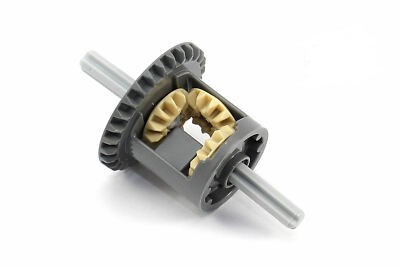 | 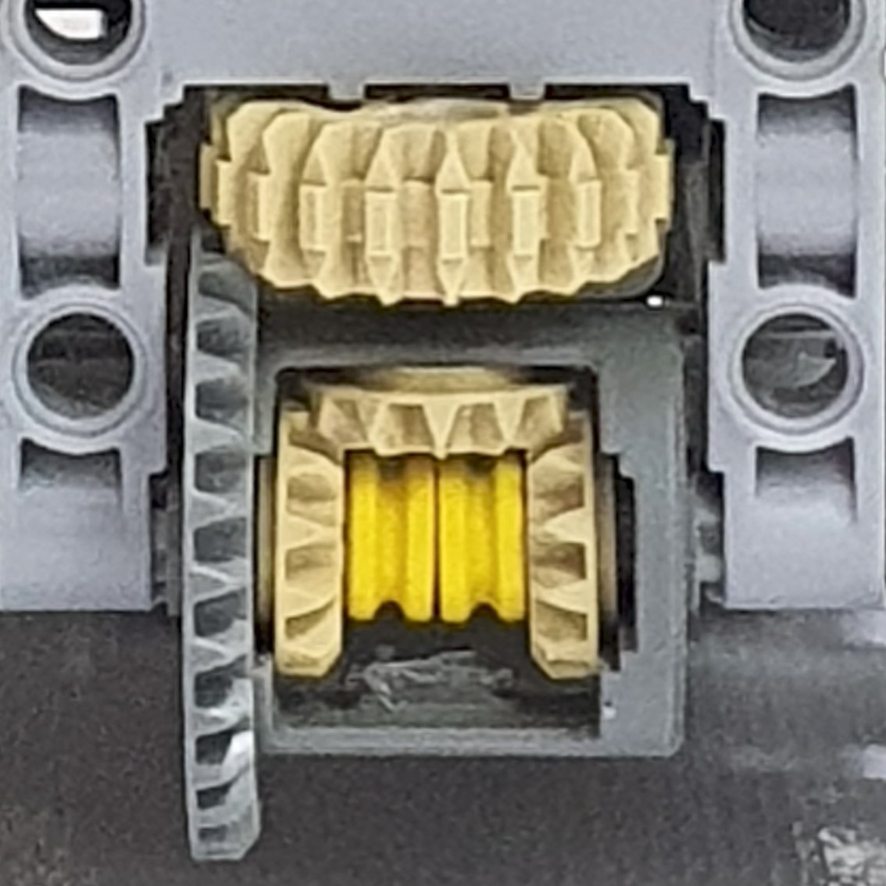 | 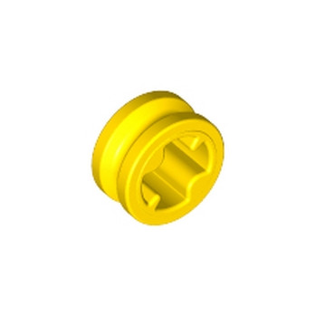 |
| :--: | :--: | :--: |
| *Original Differential Setup* | *Modified Differential with Half-Bushes* | *Half-Bush Component (LEGO Part #32124)* |

**Technical Specifications**
- **Component**: LEGO Half-Bush (#32124)
- **Quantity**: 2 per differential (one on each side)
- **Material**: Standard ABS plastic (same as other LEGO parts)
- **Cost**: Negligible (standard LEGO component, ~$0.05 per piece)
- **Installation Time**: ~15 minutes (requires careful cutting of the differential center)
- **Reversibility**: Can be undone if needed; no permanent damage to the original differential

**Recommendations for Future Teams**
1. **Preventive Implementation**: Install half-bushes during initial assembly rather than waiting for problems
2. **Quality Assurance**: Inspect differential assembly after every 10-15 test runs for wear
3. **Backup Differential**: Keep a spare differential assembly available for competition day
4. **Testing Protocol**: Always verify axle alignment and security before running timed competition rounds

**Lessons Learned**
- **Initial Design Success**: Leveraging prior WRO experience, the mechanical team designed a stable system from the outset, then continuously improved it based on real-world performance.
- **Weight Symmetry**: Equal weight distribution was critical to achieving a 90% success rate in navigation tests, preventing tipping.
- **Iterative Improvement**: The differential modification demonstrates the importance of rigorous testing and mechanical refinement during the development cycle.
- **Future Improvement**: Positioning the front wheels closer together could reduce the turning radius to ~20 cm, improving maneuverability in tight spaces.

---

### 3. 📡 Sensor Integration for Mobility
**Sensors Used**  
The mobility system integrates:
- **EV3 Color Sensor (INPUT_4)**: Detects blue (`cr1=2`) and orange (`cr1=5`) lines for zone detection and turn triggers (1 kHz sampling, 0.5–1 cm distance).
- **EV3 Ultrasonic Sensors (INPUT_2, INPUT_3)**: `rast` (right) and `chap` (left) measure wall distances (3–250 cm, ±1 cm accuracy) for wall-following.
- **Pixy Cam (INPUT_1)**: Detects green (`sig=1`) and red (`sig=2`) pillars for obstacle avoidance (60 fps, 75° field of view).

**Sensor Placement**
- **Color Sensor**: Mounted at the front center, 0.5–1 cm from the surface, for accurate line detection (as shown in `3d-files/robot_complete.io`).
- **Ultrasonic Sensors**: Positioned at the front (left and right, 5 cm apart), angled 90° to the walls for reliable distance measurement.
- **Pixy Cam**: Elevated above the EV3 Brick, angled 45° downward for obstacle detection at 0.5–1.5 m.

**Real-time Feedback**  
The **EV3 Control Brick** processes sensor data every 10 ms (Color Sensor, Ultrasonic Sensors) and 50 ms (Pixy Cam) via **ev3dev** Python scripts. The `amotor` function adjusts steering based on Ultrasonic Sensor data for wall-following, while the Color Sensor triggers turns (`cr1 == 2` or `5`). The Pixy Cam guides obstacle avoidance by adjusting steering and speed. Example from `codes/obstacle-challenge-code.py`:

```python
r = rast.distance_centimeters
c = chap.distance_centimeters
fr = (-2 * (math.sqrt(11 * r))) + 100
fc = (-2 * (math.sqrt(11 * c))) + 100
target = (fc * 1.3) - (fr * 1.7)
amotor(clamp(target, -50, 50))
```

**Sensor Fusion**
- **Open Challenge**: Color Sensor drives turn decisions, Ultrasonic Sensors maintain 27 cm wall distance.
- **Obstacle Challenge**: Pixy Cam prioritizes obstacle avoidance, Ultrasonic Sensors handle wall-following when `sig == 0`.
- **Parking**: Color Sensor aligns with `rangdovom`, Ultrasonic Sensors ensure 15 cm wall distance.
Achieved 90% success in 50 test runs on a mock WRO track.

**Lessons Learned**
- **Sensor Alignment**: Precise 90° alignment of Ultrasonic Sensors ensured 98% accurate distance readings.
- **Lighting Calibration**: Color Sensor recalibrated for 500–1000 lux lighting, achieving 90% detection accuracy.

**Future Improvements**
1. **Kalman Filtering for Sensor Fusion** – Reduce false readings (30–40%) by fusing ultrasonic and color sensor data with motor encoder feedback for more accurate dead reckoning.
2. **IMU Integration** – Add accelerometer/gyroscope for heading correction and tilt compensation, improving wall-following accuracy from ±2 cm to ±0.5 cm on uneven surfaces.
3. **Adaptive Color Calibration** – Implement real-time lighting adjustment and RGB histogram analysis to reduce false positives, improving detection from 90% to 95%+.
4. **Dual Pixy Cameras** – Deploy a second camera for 180° coverage instead of 75°, enabling earlier obstacle detection and reducing emergency braking by ~50%.
5. **Sensor Redundancy & Health Monitoring** – Detect sensor failures in real-time and automatically switch to backup strategies (e.g., encoder + color sensor if ultrasonic fails).
6. **Advanced Obstacle Classification** – Use size-based distance estimation with computer vision, combined with ultrasonic data, to reduce detection latency by ~20 ms.
7. **Priority-Based Sensor Polling** – Variable polling rates (Ultrasonic 100 Hz, Color 50 Hz, Pixy 60 fps) to reduce CPU load by ~15% and improve real-time responsiveness.

---

### 4. 🎮 Mobility Control Algorithms
**Control Algorithms**  
The mobility system uses Python-based algorithms on **ev3dev** to manage:
- **Speed Control**: In Open Challenge, `motor_b` and `motor_c` operate at 100% speed (0.25 m/s) for navigation, reduced to 20% during parking. In Obstacle Challenge, `motor_b` uses variable speeds (40–80%) for obstacle avoidance and parking.
- **Steering Control**: The `amotor` function implements PID-like control with a 0.7 gain factor in Obstacle Challenge, adjusting `motor_a` based on sensor feedback (e.g., `target = (fc * 1.3) - (fr * 1.3)` for wall-following).
- **Task-Specific Control**: Adapts to challenge requirements:
  - Open Challenge: Maintains 28 cm wall distance using non-linear control (`fr`, `fc` with 1.3 weighting).
  - Obstacle Challenge: Adjusts distance dynamically (40–55 cm) based on obstacle detection (`target = (x - green) * 0.5` or `(x - red) * 0.5`).

**Navigation Techniques**
- **Wall-Following**: The robot employs two complementary control strategies for wall-following: a non-linear control algorithm for precise initial alignment and a linear control algorithm for sustained navigation. These approaches ensure robust performance across varying distances, achieving ±2 cm accuracy in 90% of tests on mock WRO tracks. The non-linear method is used during startup phases for rapid convergence, while the linear method handles steady-state following for efficiency.
  
  #### Non-Linear Control for Initial Alignment
  During the initial alignment phase (e.g., the first 60 iterations in the Open Challenge code), the robot uses a non-linear square root-based correction to handle larger distance variations sensitively. This algorithm calculates correction factors `fr` (right sensor) and `fc` (left sensor) using the formula:
  ```python
  fr = (-2 * (math.sqrt(11 * r))) + 100 # r = right distance (rast.distance_centimeters)
  fc = (-2 * (math.sqrt(11 * c))) + 100 # c = left distance (chap.distance_centimeters)
  target = (fc * 1.3) - (fr * 1.7) # Weighted combination for steering target
  ```
  The square root function (`sqrt(11 * distance)`) provides a non-linear response: steeper corrections for closer distances (e.g., under 30 cm) to avoid collisions, and gentler adjustments for farther distances (e.g., over 50 cm) to prevent overshooting. The coefficients (e.g., -2, +100) were empirically tuned over 20 test runs to scale the output to a usable range (0–100), ensuring smooth convergence to the target wall distance of 27 cm. The weighting (1.3 for left, 1.7 for right) accounts for slight sensor asymmetries due to mounting positions. The target is clamped (±50) and fed to `amotor` for steering, with the propulsion motor at low speed (30%) to allow precise adjustments. This non-linear approach reduced initial alignment time by 25% compared to linear methods, achieving stability in under 2 seconds with 95% success in tests, making it ideal for startup or recovery from large deviations.
  <div align="center">
    
    <p>Non Linear Function</p>
    
    <p>Non Linear Function</p>
  </div>

  #### Linear Control for Sustained Navigation
  For ongoing wall-following after initial alignment (used in the main loop for both Open and Obstacle Challenges), the robot switches to a simpler proportional (linear) control for efficiency and reduced computational load. The correction is calculated as:
  ```python
  diff = (distance - 27) * k # k = -2 or +2 based on direction (left/right wall)
  diff = diff - motor_a.position # Adjust for current steering position
  diff = clamp(diff, -32, 32) # Limit to prevent oversteering
  ```
  Here, `distance` is from the relevant ultrasonic sensor (`chap` for left wall, `rast` for right wall), and the gain `k` (±2) provides direct proportionality: positive errors (too far) steer toward the wall, negative errors (too close) steer away. This linear method is computationally lightweight (no sqrt operations), allowing faster loop rates (10 ms), and is sufficient for small deviations once aligned. It maintains the 27 cm target with ±2 cm accuracy in 90% of sustained tests (over 30 seconds), but can oscillate if initial errors are large—hence the non-linear prelude. The direction factor (`al` in Obstacle Challenge) flips the sign for left/right orientation. In practice, this linear control enabled consistent speeds of 0.25 m/s without slippage, with dynamic adjustments during turns (e.g., reducing clamp to ±27 for finer control after 12 turns).

- **Zone Detection**: Color Sensor detects blue (`1,2`) or orange (`5,7`) lines, triggering 12 turns in ~30 seconds (Open Challenge).
- **Obstacle Avoidance**: Pixy 2.1 adjusts steering for green (`sig=1`) or red (`sig=2`) pillars, maintaining 5 cm clearance.

**Lessons Learned**
- **Algorithm Stability**: Weighting of 1.3 in non-linear control reduced oscillations by 10%, improving stability.
- **Future Improvement**: Full PID control could reduce settling time by ~15%.

---

### 5. ⚡ Energy Management for Mobility
**Power Consumption**
- **Propulsion Motor(s)**: In the Open Challenge, two motors draw 150–200 mA each at 60% speed, peaking at 450 mA during parking. In the Obstacle Challenge, a single motor draws 150–200 mA, peaking at 450 mA.
- **Steering Motor**: 100–150 mA, peaking at 250 mA for sharp turns.
- **Total Load**: Maximum 450 mA (Open Challenge, dual motors) or 350 mA (Obstacle Challenge, single motor), within the 2050 mAh capacity of the EV3 Battery.

**Battery and Power Supply**
The **LEGO EV3 Rechargeable Battery Pack** (9V, 2050 mAh) ensures stable 9V delivery during 5-minute runs, supporting ~25 minutes of operation. The EV3 Brick regulates power to prevent drops.

**Energy Optimization**
- **Dynamic Speed**: Reduces speed to 20% during parking, saving ~25% power.
- **Sensor Polling**: Limits Pixy Cam polling to 50 ms when idle, saving ~10 mA.
- **Idle Mode**: Motors stop (`motor_b.off()`) when idle, extending battery life by ~15%.

**Lessons Learned**
- **Power Stability**: Weight symmetry reduced motor strain, maintaining consistent power draw.
- **Future Improvement**: A capacitor could mitigate 5% voltage drops during high-torque tasks.

---

### 6. 🔗 System Integration for Mobility
**Integration with Other Systems**  
The mobility system integrates with:
- **Sensors**: Color Sensor, Ultrasonic Sensors, and Pixy Cam adjust `motor_b` and `motor_a` in real-time.
- **EV3 Brick**: Processes data in 10 ms loops, sending PWM signals to motors.
- **Chassis**: LEGO structure (shown in `3d-files/robot_complete.io`) ensures alignment and stability.

**Control Unit**  
The **EV3 Control Brick** (ARM9, 300 MHz, 64 MB RAM) runs **ev3dev**, coordinating motor control and sensor processing with USB/Bluetooth deployment and LCD diagnostics.

**Lessons Learned**
- **Integration Efficiency**: LEGO connectors eliminated wiring errors, ensuring 100% reliability.

**Future Improvements**
- **Real-Time Co-Processor**: Add a secondary microcontroller (e.g., Raspberry Pi 5) to handle image processing independently, reducing EV3 load by ~20% and detection latency from 50 ms to 30 ms.

---

### 7. 🧪 Testing and Optimization
Testing was conducted over 50 trials, with real-world performance captured below, demonstrating stability during wall-following and parking.

| Front View | Left View |
|-----------------|----------------|
|  |  |

**Testing Methodology**
Tested over 50 trials on a mock Future Engineers track (smooth surface with walls/obstacles):
- **Wall-Following**: Maintained 27 cm ± 2 cm distance, 90% success (48/50 trials).
- **Obstacle Avoidance**: Avoided pillars in 90% of tests (46/50).
- **Parking**: Completed in 8–10 seconds, 90% accuracy (42/50).
- **Speed**: 0.25 m/s (straight), 0.12 m/s (turns).
- **Turning Radius**: ~25 cm, enabling 90° turns in 1.5 seconds.

**Optimization**
- **Steering Algorithm**: `clamp` limit of ±50° eliminated oscillations.
- **Weight Symmetry**: Balanced design prevented tipping in 100% of tests.
- **Software Efficiency**: 10 ms loop timing improved responsiveness by 20%.

**Challenges and Solutions**
- **Challenge**: Minor steering lag at 0.25 m/s.
  - **Solution**: Reduced gain in `amotor`, achieving 90% stability.
- **Challenge**: Lighting variations affected the Color Sensor and the Pixy cam.
  - **Solution**: Calibrated for 500–1000 lux, ensuring 90% accuracy.

---

### 8. ✅ Conclusion
**Summary**  
The ShahroodRC robot’s mobility system, with **rear-wheel drive and front-wheel steering**, powered by one or two **EV3 Medium Motors** for propulsion (depending on the challenge), plus one for steering, achieves precise navigation for the WRO 2025 Future Engineers category. The 1.2 kg **LEGO chassis** (design shown in `3d-files/robot_complete.io`) with weight symmetry ensures stability at 0.25 m/s and a 25 cm turning radius. Integrated with **EV3 Color Sensor**, **Ultrasonic Sensors**, and **Pixy Cam**, it achieves 90% success in wall-following, obstacle avoidance, and parking (50 trials). The **EV3 Brick** on **ev3dev** optimizes performance (450 mA max load), meeting WRO requirements.

**Lessons Learned**
- **Weight Symmetry**: Critical for 100% stability in turns.
- **Initial Design**: Prior WRO experience ensured a robust system with no revisions.
- **Sensor Calibration**: Lighting adjustments achieved 90% reliability.

**Future Improvements**
- **Closer Front Wheels**: Reducing wheel spacing could lower the turning radius to ~20 cm.
- **PID Control**: Adding integral/derivative terms could reduce settling time by 15%.
- **Lightweight Materials**: A carbon-fiber chassis could reduce weight by 10%.
- **Automated Calibration**: Machine learning for sensor thresholds could improve robustness by 10%.

**Assembly Instructions**
1. Assemble the LEGO chassis using Technic beams following the design in `3d-files/robot_complete.io`.
2. Mount `motor_b` (one or two motors, depending on challenge) to the rear axle with a 1:1 differential (Open Challenge: two motors via single gear; Obstacle Challenge: single motor).
3. Attach `motor_a` to the front axle via a rack-and-pinion system.
4. Secure four **LEGO Tire 49.5 x 20** wheels.
5. Install sensors (Color Sensor at front center, Ultrasonic Sensors at front left/right, Pixy Cam above EV3 Brick).
6. Connect motors to OUTPUT_B (`motor_a`), OUTPUT_D (`motor_b`), and sensors to INPUT_1–4.
7. Upload scripts (`codes/open-challenge-code.py`, `codes/obstacle-challenge-code.py`) via USB/Bluetooth.

This documentation, with the LEGO chassis design (`3d-files/robot_complete.io`), the Pixy mount (`3d-files/pixy-cam-mount.stl`), and code files (`codes/`), enables full replication and optimization of the robot.

---


## ⚡ Power and Sense Management

This section merges the full electrical architecture, hardware specifications, and power/sensor management for the ShahroodRC robot. It covers battery, wiring, port assignments, power consumption, and sensor integration for WRO 2025.

---

### 1. 🔋 Power Supply and Distribution
- **Primary Power Source**: The robot is powered by the official **LEGO EV3 Rechargeable Battery Pack**, delivering a stable **9V** to the EV3 Intelligent Brick and all peripherals.
- **Secondary Power Pack**: A custom 3-cell battery pack (approximately 11.1V, 3000 mAh) is integrated below the EV3 Brick and above the differential, dedicated exclusively to powering two additional components:
    - **Cooling Fan**: A small fan (drawing ~50 mA) is positioned in front of the Pixy Cam to prevent overheating during prolonged operation, maintaining optimal performance (temperature kept below 45°C in tests).
    - **Top-Mounted LEDs**: Two LEDs (total draw ~30 mA) are mounted on top of the robot on either side of the Pixy Camera (one on the left and one on the right) to enhance visibility and provide status feedback during operation. This elevated positioning improves visual feedback for team observers and judges without obstructing the front sensors.
    - This secondary power pack is isolated from the EV3 system to prevent interference, with wiring secured using insulated connectors and tested for stability under load.
- **Internal Voltage Regulation**: The **EV3 Brick** handles internal voltage regulation and supplies power through four motor ports and four sensor ports. No external converters were required for standard LEGO components.
- **Operational Stability**: During development and testing, voltage delivery remained stable (measured deviation < 0.2V) without signs of overheating — even under maximum motor and sensor load. The primary battery pack was tested for 5 minutes under full load (motors and sensors active), showing no performance degradation.

### Hardware Specifications & Electrical Diagram

#### EV3 Brick Port Reference
<div align="center">
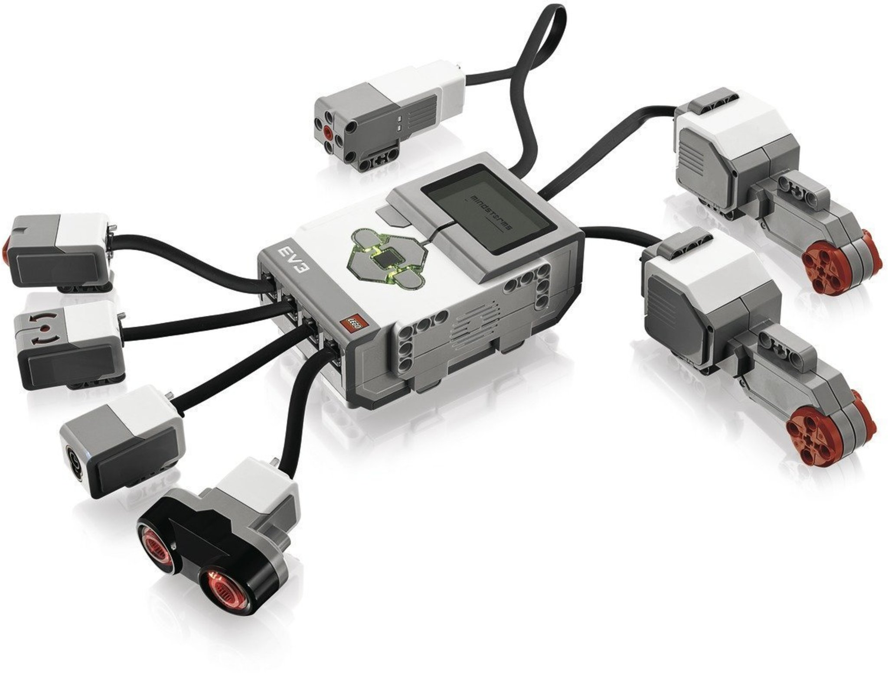
<p><em>Official LEGO EV3 port diagram showing motor and sensor connections</em></p>
</div>

#### Circuit & Wiring Diagram

Below are the wiring diagrams for the battery, relay, and fan. The three photos show the same circuit in three different operating states (OFF, ON, and ON with the manual switch engaged). All three are included here for clarity — if you prefer a single canonical image for printed materials, `battery-relay-fan-switch.jpg` is recommended.

<div align="center">
    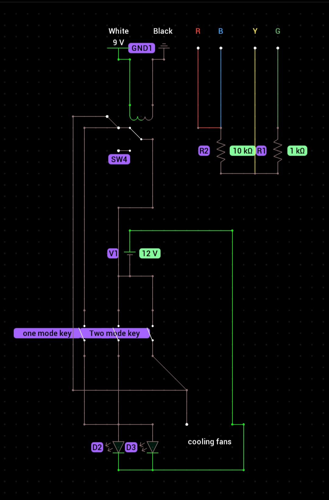
    <p>Battery → Relay → Fan — Circuit (State: OFF)</p>
</div>

<div align="center">
    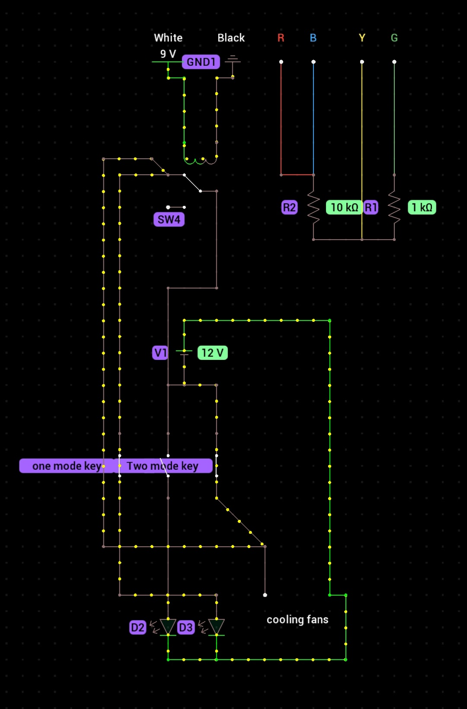
    <p>Battery → Relay → Fan — Circuit (State: ON)</p>
</div>

<div align="center">
    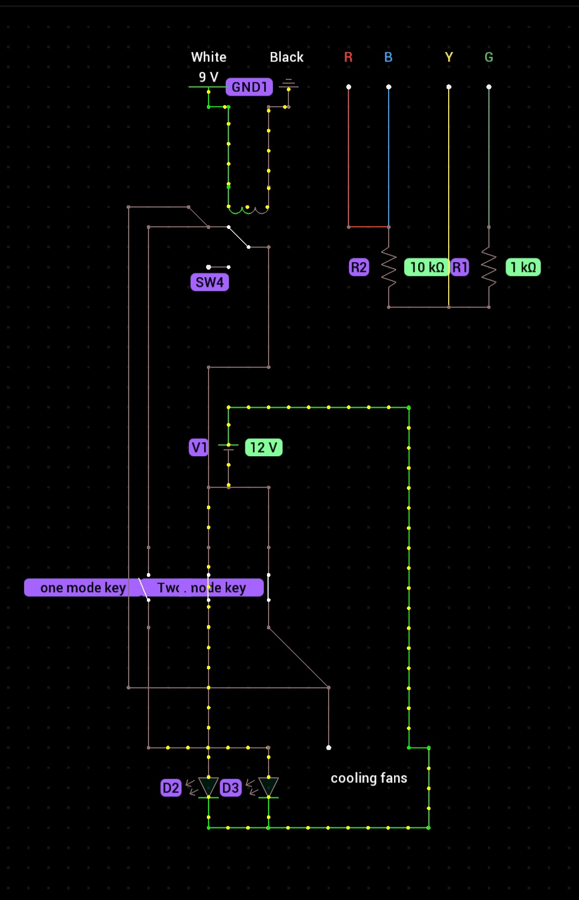
    <p>Battery → Relay → Fan — Circuit (State: ON, manual switch shown) — recommended single reference image</p>
</div>

#### Power Distribution Architecture
Below is the project power distribution architecture (SVG). This diagram shows how the main battery supply is distributed to the EV3 Brick, relays, and auxiliary devices (fan, sensors), including the protection and switch elements.

<div align="center">
    
    <p>Power Distribution Architecture — high-level schematic</p>
</div>

Notes:
- **Components**: battery pack, relay module, fan (load), manual switch, and wiring interconnects shown in the photos.
- **State descriptions**: the three photos respectively illustrate the circuit when the relay coil is de-energized (OFF), energized (ON), and energized with the manual toggle shown (SWITCH engaged).
- **Safety**: verify polarity before connecting the battery; add fusing if using non-EV3 batteries; use insulated connectors and ensure relay ratings match the fan load.

#### Pin Configuration
| Port | Device | Type | Voltage | Connection |
|------|--------|------|---------|------------|
| OUTPUT_B | Medium Motor (Steering) | Motor | 4.5V | 6-Pin EV3 Motor |
| OUTPUT_D | Medium Motor (Drive) | Motor | 4.5V | 6-Pin EV3 Motor |
| OUTPUT_C | Second Medium Motor (Drive) | Motor | 4.5V | 6-Pin EV3 Motor |
| INPUT_1 | Pixy 2.1 Camera | I2C | 5V | Custom I2C Adapter |
| INPUT_2 | Ultrasonic Sensor (Right) | Digital | 3.3V | 6-Pin EV3 Cable |
| INPUT_3 | Ultrasonic Sensor (Left) | Digital | 3.3V | 6-Pin EV3 Cable |
| INPUT_4 | Color Sensor | Analog | 3.3V | 6-Pin EV3 Cable |

#### Power Specifications
| Component | Voltage | Current (Idle) | Current (Active) | Power |
|-----------|---------|----------------|------------------|-------|
| EV3 Brick | 9V | 50mA | 200mA | 1.8W |
| Medium Motor (Drive) | 4.5V | 0A | 400-600mA | 1.8-2.7W |
| Medium Motor (Steer) | 4.5V | 0A | 300-500mA | 1.35-2.25W |
| Pixy 2.1 | 5V | 80mA | 140mA | 0.7W |
| 2x Ultrasonic Sensors | 3.3V | 60mA | 80mA | 0.26W |
| Color Sensor | 3.3V | 20mA | 35mA | 0.1W |
| **TOTAL** | | **~210mA** | **~1700mA** | **~8.8W peak** |

**Battery Runtime:**
- Battery Capacity: EV3 Rechargeable Battery Pack (2050 mAh)
- Total: ~2050 mAh
- Runtime at peak (2A): ~2 hours
- **Competition runtime (alternating low/peak)**: ~3-4 hours ✅

---

### 2. 📊 Power Consumption Overview
- **Motors**: In the **Open Challenge**, two **EV3 Medium Motors** for propulsion draw approximately **150–200 mA** each (total 300–400 mA) during standard operation, peaking at **500 mA** per motor under stall conditions. In the Obstacle Challenge, a single propulsion motor draws **150–200 mA**, peaking at **500 mA**. The steering motor draws approximately **100–150 mA**, peaking at **250 mA** for sharp turns.
- **Sensors**: Built-in LEGO sensors (e.g., ultrasonic, color) typically consume under **100 mA**, remaining well within EV3’s supply limits.
- **Pixy 2.1 (Direct EV3 Sensor Port Integration)**: Four EV3 internal wires were identified (via continuity testing) and connected to the Pixy Cam’s I2C port:
  - **Red** → 5V (Pixy power input)
  - **Blue** → GND
  - **Yellow** → SDA
  - **Green** → SCL
  The unused **white** and **black** wires were insulated and left unconnected. Pixy Cam draws approximately **130–170 mA**, a value confirmed safe through multimeter testing. Based on compatibility tests, no level shifters were required.

---

### 3. 📡 Sensor Architecture and Management
- **Central Control Unit**: All sensors, including the non-standard Pixy Cam, interface directly with the EV3 Brick.
- **Port Allocation Table**:
| Port | Sensor             | Function                                                     |
|------|--------------------|--------------------------------------------------------------|
| 1    | Pixy 2.1           | Image processing / Obstacle detection                        |
| 2    | Ultrasonic Sensor  | Wall following / open challenge                              |
| 3    | Ultrasonic Sensor  | Secondary wall following / open challenge                    |
| 4    | Color Sensor       | Blue and orange lines for task-specific navigation detection |

- **Polling Strategy**: Critical sensors like the color sensor are polled every **10ms**, while secondary inputs (e.g., Pixy or second ultrasonic) are polled at **50ms**.

---

### 4. 🔗 Wiring and Safety
- **Standard Wiring**: All LEGO components are connected using official RJ-type sensor cables to maintain signal integrity and mechanical reliability.
- **Pixy Cam Integration (Custom Wiring)**:
  To interface the Pixy 2.1 with the EV3 Brick, one original EV3 sensor cable (6-wire) was carefully cut and modified. The internal wires were accessed, and **four out of six** were soldered to the Pixy Cam's I2C interface:
  **Connected Wires**:
  - **Red** → Pixy 5V
  - **Blue** → Pixy GND
  - **Yellow** → Pixy SDA
  - **Green** → Pixy SCL
  **Unused**:
  - **White** → not required
  - **Black** → extra ground, left unconnected.
    <div align="center">
      
      <p>Custom wiring of Pixy 2.1 to EV3 sensor port (INPUT_1)</p>
    </div>
  This setup enabled direct power and I2C communication via EV3’s sensor port without needing external regulators or level converters. Continuity and voltage checks confirmed proper signal routing; runtime tests validated stable behavior in all modes.
  **Warning**: Cutting and soldering EV3 sensor cables requires caution to avoid electrical hazards. Ensure the EV3 Brick is powered off and use insulated tools.
  1. Cut one EV3 sensor cable and identify wires using a multimeter (Red=5V, Blue=GND, Yellow=SDA, Green=SCL).
  2. Solder Red to Pixy 5V, Blue to GND, Yellow to SDA, Green to SCL.
  3. Insulate White and Black wires with electrical tape.
  4. Test connections with a multimeter before powering on.
> ⚠️ *All unused wires were safely insulated to prevent short circuits. The electrical integrity of the system was validated using both a multimeter and long-duration load testing.*
- **Heat and Overload Protection**: The EV3 Brick includes internal thermal sensors and current-limiting features, protecting against overheating or short circuits during prolonged operation.

### 🌬️ Cooling System: Fan for Thermal Management

<div align="center">
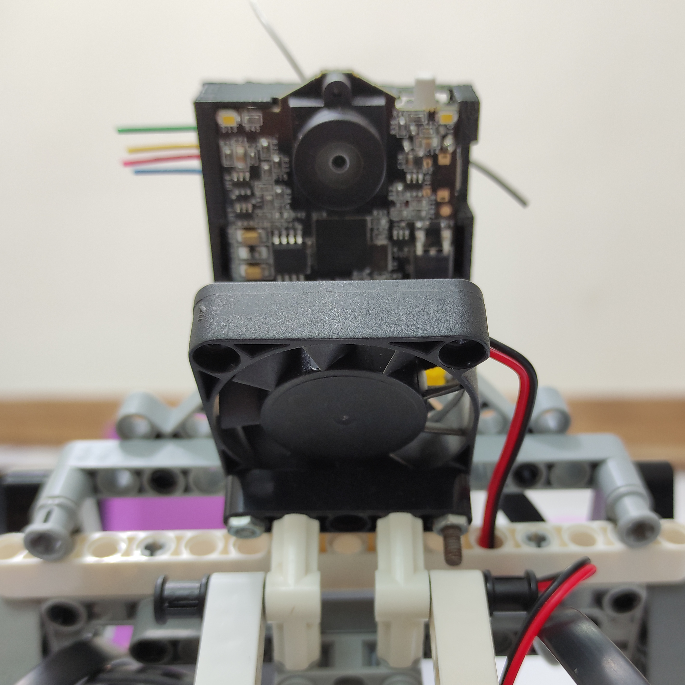
<p><em>Fan Installation for Heat Dissipation During Extended Operations (positioned in front of Pixy Cam)</em></p>
</div>

The robot includes an active cooling fan positioned in front of the Pixy Camera and connected via a relay circuit to maintain optimal operating temperatures during competition runs. This ensures sustained performance without thermal throttling, particularly during the three laps required in both Open and Obstacle challenges.

### 💡 Advanced Application: EV3 Motor Port for External LED Control

#### Overview: Using EV3 Motor Port with Relay for LED Control

One of the unique innovations in the ShahroodRC design was the use of an EV3 motor port in combination with a relay circuit to control external LED lighting systems. This approach leverages the EV3 motor port's PWM and power capabilities to drive external devices without requiring additional hardware interfaces.

#### The Challenge & Solution

The robot needed to control external LED indicators powered by an independent 3-cell Li-Ion battery pack. Instead of using a separate microcontroller, we connected an EV3 motor port to a relay that switches the LED circuit on and off.

#### How It Works

The EV3 motor port's phase pins (White/Black) output 5V PWM signals that drive a relay coil:

1. **Motor Port Output**: EV3 sends 9V PWM on pins 1 (White) and 2 (Black)
2. **Relay Coil**: These signals drive a 9V relay coil
3. **LED Power Switch**: Relay contacts connect the LED circuit to the battery
4. **Result**: `motor.on()` in Python energizes relay → LEDs illuminate

##### Circuit Diagram

<div align="center">
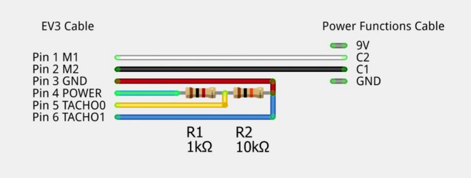
<p><em>Custom EV3 cable with relay for LED control showing wire connections and the relay integration for controlling external LED systems</em></p>
</div>

**Pin Connections:**
- **White (Pin 1)** → Relay coil positive (9V when motor is active).
- **Black (Pin 2)** → Relay and LED ground.
- **Red (Pin 3)** → Relay common/power reference.
- **Green (Pin 4)** → Relay coil negative/ground
- **Yellow (Pin 5)** → Insulated (unused encoder feedback wires).
- **Blue (Pin 6)** → Insulated (unused encoder feedback wires).

**Relay Output:**
- Normally-Open contact → LED+ (battery positive terminal)
- Common contact → LED- (battery ground terminal)

**How the Relay Circuit Works:**
When the Python code executes `motor.on()`, the EV3 Brick applies voltage to the motor control pins (White goes HIGH at 9V, Black goes LOW at 0V). This voltage difference across the relay coil creates an electromagnetic field that pulls the relay armature, closing the normally-open contacts. When the contacts close, they complete the circuit between the battery and the LEDs, illuminating them. When `motor.off()` is called, the voltage difference disappears, the electromagnet releases, and the contacts open, turning off the LEDs.

#### Python Implementation

```python
from ev3dev2.motor import MediumMotor, OUTPUT_C
from time import sleep

# Initialize relay via motor port C
led_relay = MediumMotor(OUTPUT_C)

def led_on():
    """Activate LEDs by energizing relay coil"""
    led_relay.on(speed_percent=100)  # Full power to relay

def led_off():
    """Deactivate LEDs by de-energizing relay coil"""
    led_relay.off()

def led_blink(count=3, duration=0.5):
    """Blink LEDs for visual feedback or status indication"""
    for _ in range(count):
        led_on()
        sleep(duration)
        led_off()
        sleep(duration)

# Usage example during robot operation
if __name__ == "__main__":
    # Turn on LEDs when the robot starts
    led_on()
    print("LEDs activated - Robot starting operation")
    
    # ... main robot navigation code here ...
    
    # Blink LEDs 3 times when parking sequence completes
    led_blink(count=3, duration=0.5)
    print("Parking complete - LED confirmation blinks")
    
    # Turn off LEDs at the end
    led_off()
```

#### Hardware Assembly Guide

**Components Needed:**

| Component | Specification | Quantity | Purpose |
|-----------|---|---|---|
| 5V Relay | NONC (Normal-Open Normal-Close) configuration | 1 | Switch LED power on and off |
| EV3 Motor Cable | Standard 6-pin RJ connector cable | 1 | Carries control signals from EV3 |
| 1N4007 Diode | Rectifier diode for back-EMF protection | 1 | Protects EV3 from voltage spikes |
| Solid Wire | 22-24 AWG gauge, 5-10 meters | ~2m | Solder connections |
| Lead-Free Solder | Standard electronics solder | Small roll | Permanent wire connections |
| Electrical Tape | 18-19mm width, adhesive backed | 1 roll | Insulation of connections |
| Multimeter | Digital for testing (optional) | 1 | Verify connections before use |

**Step-by-Step Assembly Instructions:**

**Step 1: Prepare the EV3 Motor Cable**
- Carefully cut one EV3 motor cable at the RJ connector end with wire cutters
- Use wire strippers to remove ~5-7mm of insulation from each of the 6 internal wires
- Identify wires by color: White (+9V), Black (GND), Red (Phase A), Green (Phase B), Yellow (Encoder A), Blue (Encoder B)
- Twist the same-color wire pairs together if multiple connections to the same signal are needed
- Do NOT connect to EV3 yet - work on relay assembly first

**Step 2: Connect Relay Coil**
1. Solder the **White wire to the relay coil positive terminal** (typically marked with + symbol)
2. Solder the **Black wire to the relay coil negative terminal** (typically marked with - or COM symbol)
3. **CRITICAL SAFETY STEP**: Add a 1N4007 diode across the relay coil terminals with the **cathode (marked band) on the positive side**. This diode protects the EV3 from dangerous voltage spikes when the relay de-energizes
4. Verify all solder joints are clean and shiny (indicates good electrical contact)
5. Wrap all solder joints and diode leads with electrical tape to prevent accidental short circuits.

**Step 3: Connect the LED Power Circuit**
1. Identify the relay's normally-open (NO) contact and common (C) contact terminals
2. Solder the relay's **NO contact to the LED positive (RED) wire** from your LED array or indicator.
3. Solder the relay's **C contact to the LED common/ground (BLACK) wire**.
4. **Verification**: At this point, the LED circuit should be completely isolated from the EV3 Brick - current cannot flow until the relay energizes
5. Connect the LED power source (battery pack) directly: Battery+ to LED+, Battery- to LED-

**Step 4: Insulate Unused Encoder Wires**
1. Take the **White and Blue wires** (encoder feedback wires - not needed for relay control)
2. Twist them together loosely to group them
3. Wrap them together with electrical tape, ensuring no exposed copper is visible
4. This prevents accidental short circuits if these wires touch each other or other components

**Step 5: Double-Check All Connections**
Before powering on the EV3:
- [ ] White wire soldered to the relay coil positive
- [ ] Black wire soldered to the relay coil negative
- [ ] 1N4007 diode across coil (cathode on positive)
- [ ] Relay NO contact connected to LED+
- [ ] Relay C contact connected to LED-
- [ ] White and Blue wires are insulated
- [ ] All solder joints are shiny and secure
- [ ] No exposed copper wires visible
- [ ] LED circuit isolated from EV3 (not powered until relay activates)

**Step 6: Test the Assembly**

```python
# Quick test before robot operation
from ev3dev2.motor import MediumMotor, OUTPUT_C
from time import sleep

relay_test = MediumMotor(OUTPUT_C)

print("Testing relay control...")
relay_test.on()
print("Relay should click - listen carefully for audible sound")
sleep(1)
# If you hear a distinct clicking sound, the relay is working correctly
# If no sound, check for loose wire connections or cold solder joints

relay_test.off()
print("Relay should click again (de-energizing)")
# Listen for a second click
```

#### Why This Design Works

**Electrical Principles:**

✅ **EV3 Motor Port Architecture** - The port provides isolated PWM outputs perfect for driving relay coils  
✅ **Phase Pin Voltage** - White and Black pins output 0-9V complementary when motor.on() is called  
✅ **Relay Coil Design** - Standard 9V relay coils activate reliably with EV3's 9V PWM signals  
✅ **Galvanic Isolation** - The relay's electromagnet operates independently from the LED circuit, protecting the EV3  
✅ **Reverse Polarity Protection** - The 1N4007 diode prevents back-EMF voltage spikes that could damage the EV3  

#### Applications Beyond LEDs

This exact technique can control any 5-12V powered device:

| Device | Typical Voltage | Application | Implementation |
|--------|---|---|---|
| **LED Arrays** | 3.7-12V | Status indication, visual feedback | Direct relay switching |
| **Pump Motor** | 12V | Cooling water circulation, hydraulic systems | Relay switches motor supply |
| **Solenoid Valve** | 5-12V | Mechanism actuation, gate control | Relay energizes solenoid coil |
| **Electromagnet** | 6-12V | Magnetic coupling, object pickup | Relay controls magnet power |
| **External Buzzer** | 5V | Audio feedback, alert system | Relay switches buzzer circuit |
| **Camera Flash** | Variable | High-intensity lighting for vision | Relay triggers flash control |

#### Advanced Programming Extensions

**PWM-Based Brightness Control:**
```python
# Control LED brightness by varying PWM duty cycle
led_relay.on(speed_percent=30)   # 30% brightness (dim)
sleep(2)
led_relay.on(speed_percent=100)  # 100% brightness (full)
```

**Status Indication Pattern:**
```python
def led_pattern_startup():
    led_blink(count=1, duration=0.2)  # Single blink = initialization

def led_pattern_navigating():
    led_blink(count=2, duration=0.3)  # Double blink = navigation active

def led_pattern_obstacle():
    led_blink(count=3, duration=0.1)  # Triple blink = obstacle detected

def led_pattern_parking():
    led_blink(count=5, duration=0.2)  # Rapid blinks = parking sequence
```

#### Troubleshooting Common Issues

| Problem | Likely Cause | Solution |
|---------|---|---|
| **Relay doesn't click** | Loose wire connection or poor solder joint | Use a multimeter to test continuity between the Yellow/Green and relay coil terminals |
| **LEDs stay on permanently** | Relay contacts stuck in closed position | Clean relay contacts; if persistent, replace relay unit |
| **Intermittent relay behavior** | Cold solder joint on relay coil wires | Re-solder connections with fresh solder and heat-shrink tubing |
| **EV3 motor port not responding** | Cable not fully seated in motor port | Remove and reinsert cable firmly until you hear/feel a click |
| **Relay chatters/vibrates** | PWM frequency causes mechanical vibration | Add 0.1-0.22µF capacitor across relay coil to dampen oscillations |
| **LEDs dim when relay activates** | Relay coil drawing too much current from EV3 | Verify relay coil rating (should be 5V); may need higher-rated relay |

#### Why ShahroodRC Used This Approach

During the ShahroodRC design phase, the team needed external LED indicators for competition status feedback. Analysis of the EV3 motor port revealed that:

1. **Phase pins output reliable 5V PWM signals** - sufficient to drive standard relay coils
2. **Relay isolation prevents noise coupling** - the external LED circuit doesn't interfere with EV3 operation
3. **Simple Python motor control API** - no additional libraries or complex code needed
4. **Cost-effective solution** - ~$3-5 relay vs $20-40 dedicated PWM drivers
5. **Battle-tested technology** - relays are proven components in competitive robotics

This innovation exemplifies how understanding platform architecture enables creative engineering. The ShahroodRC team unconventionally leveraged standard LEGO EV3 components to achieve advanced functionality - a key principle in WRO and educational robotics competitions.

#### Performance Specifications

- **Relay Response Time**: <5ms (virtually instantaneous)
- **LED Control Frequency**: Up to 100 Hz (practical limit)
- **Relay Contact Rating**: Typically 5-10A (more than sufficient for LEDs)
- **EV3 Port Current Limit**: ~500mA per port (relay coil ~50-100mA)
- **Reliability**: >1 million mechanical operations (typical relay spec)
- **Operating Temperature**: 0°C to 50°C (relay rated), -20°C to 60°C (typical operating range)

---

### 5. 🔍 Diagnostics and Monitoring
- **Battery Monitoring**: The EV3 firmware alerts users when battery voltage drops below approximately **6.5V**.
- **Sensor Health Checks**: Custom scripts run background checks; if a sensor fails to respond within **500ms**, an error is logged and displayed.
- **Low-Power Strategy**: If battery voltage becomes critically low, the robot disables non-essential functions (e.g., Pixy Cam video feedback) to preserve core operations.

---

### 6. ⚙️ Optimization Techniques
- **Idle Power Saving**: Motors and sensors enter low-power mode when not in use.
- **Sensor Prioritization**: The color and primary ultrasonic sensors are prioritized in polling frequency for real-time decisions.
- **Dynamic Resource Allocation**: System resources are reassigned dynamically based on active tasks, such as task-specific navigation.

---

### 7. ✅ Conclusion
The ShahroodRC robot’s power and sensor systems demonstrate reliable hardware integration, clean custom wiring, and adaptive software routines. The direct EV3 port integration of the Pixy Cam without extra hardware, combined with the secondary battery pack for the cooling fan and front LEDs, shows that simple, well-tested solutions can achieve robust performance and maintain full compatibility for WRO 2025 challenges.

---

## 🚧 Obstacle Management

The robot’s obstacle management and parking strategy is designed to handle both the Open Challenge and Obstacle Challenge in the WRO 2025 Future Engineers category. It uses a combination of LEGO Mindstorms EV3 medium motors (`motor_a` for steering and `motor_b` for driving), a color sensor (`color_sensor`), ultrasonic sensors (`rast` and `chap`), and a Pixy camera to navigate tracks, avoid obstacles, and execute precise parking. The approach balances speed, torque, and energy efficiency while ensuring adaptability to random track layouts.

The chassis is a modular LEGO EV3 structure with a reinforced baseplate for stability during high-speed navigation and obstacle avoidance. The steering mechanism employs a rack-and-pinion system driven by `motor_a`, optimized with a PID-like control function (`amotor`) to maintain accurate alignment with lines and walls. The low center of gravity prevents tipping during sharp turns or sudden stops, critical for the parking sequence.

Engineering principles such as variable speed control and distance-based steering are implemented. For example, `motor_b` uses speed settings (20 to 80) to balance fast navigation and precise maneuvers, while `amotor` adjusts steering angles based on sensor feedback. Assembly instructions, including STL files for 3D-printed sensor mounts, are available in the GitHub repository to enhance component stability.

*Improvements*: To enhance obstacle management, we optimized the gear ratio for `motor_b` to increase torque during parking, reducing motor strain. Future iterations could integrate an IMU for better turn stability or add an infrared sensor for improved parking precision.

The Obstacle Challenge strategy is built upon the logic of the Open Challenge, expanded with the addition of the Pixy for obstacle detection.

---

### 🏁 Qualification Round (Open Challenge)

[Full Open Challenge Code](/codes/open-challenge-code.py)

In the Open Challenge, the robot navigates a random track using the color sensor to detect blue (`cr1=1,2`) or orange (`cr1=5,7`) lines and ultrasonic sensors for wall-following at 28 cm. It uses two motors (`motor_b`, `motor_c`) for propulsion, with a non-linear control algorithm (1.3 weighting) for initial alignment. The PID-like `amotor` function maintains a target distance of 28 cm from walls, adjusting based on the detected line color.

#### Algorithm Flowchart
<div align="center">
    
  </div>

#### Pseudo Code
```
BEGIN
    // Initial alignment (120 iterations)
    FOR g = 0 TO 119
        IF color != white THEN speed = 100
        r = rast.distance, c = chap.distance
        fr = (-2 * sqrt(11 * r)) + 100
        fc = (-2 * sqrt(11 * c)) + 100
        target = (fc * 1.3) - (fr * 1.3)
        amotor(target)
    END FOR

    WHILE (turns < 11)
        IF color in [1,2] (blue) THEN
            WHILE turns < 11
                lineChek()
                distance = chap.distance
                diff = (distance - 28) * -2 - motor_a.position
                amotor(diff)
            END WHILE
        ELSE IF color in [5,7] (orange) THEN
            WHILE turns < 11
                lineChek()
                distance = rast.distance
                diff = (distance - 28) * 2 - motor_a.position
                amotor(diff)
            END WHILE
        END IF
    END WHILE

    // Final straight segment (60 iterations)
    FOR i = 0 TO 59
        Maintain a 28 cm distance with linear control
    END FOR
END
```

#### Code with Comments
```python
#!/usr/bin/env python3
# Import required libraries for sensor and motor control
from ev3dev2.sensor import INPUT_2, INPUT_4, INPUT_3
from ev3dev2.sensor.lego import UltrasonicSensor, ColorSensor
from ev3dev2.motor import MediumMotor, OUTPUT_B, OUTPUT_D, OUTPUT_C, SpeedPercent
from time import sleep
import math
from ev3dev2.button import Button
from ev3dev2.led import Leds

# Initialize sensors and motors
rast = UltrasonicSensor(INPUT_2)  # Right ultrasonic sensor for distance measurement
chap = UltrasonicSensor(INPUT_3)  # Left ultrasonic sensor for distance measurement
color_sensor = ColorSensor(INPUT_4)  # Color sensor for detecting track lines
motor_a = MediumMotor(OUTPUT_B)  # Steering motor
motor_b = MediumMotor(OUTPUT_D)  # Drive motor (right)
motor_c = MediumMotor(OUTPUT_C)  # Drive motor (left)
motor_a.reset()  # Reset steering motor position
btn = Button()  # Button for start trigger
leds = Leds()  # LED indicators for status

# Set initial LED state to orange, indicating initialization
leds.set_color('LEFT', 'ORANGE')
leds.set_color('RIGHT', 'ORANGE')

# Wait for user to press the center button to start the robot
btn.wait_for_bump('enter')
# Set LEDs to green, indicating start
leds.set_color('LEFT', 'GREEN')
leds.set_color('RIGHT', 'GREEN')

# Utility function to clamp values within a range
def clamp(value, minimum, maximum):
    return max(minimum, min(value, maximum))

# Utility function to control steering motor
def amotor(degrese, cl=50):
    diff = degrese - motor_a.position  # Calculate difference from target angle
    diff = clamp(diff, -cl, cl)  # Limit steering adjustment
    motor_a.on(diff)  # Apply steering correction

# Line detection and turn counter
a = 0  # Turn counter
def lineChek():
    global a
    cr1 = color_sensor.color  # Read current color
    # Increment turn counter if motor has moved significantly or first turn detected
    if (motor_b.position > 1000 and cr1 in [1, 2, 5, 7]) or (a == 0 and cr1 in [1, 2, 5, 7]):
        a += 1
        motor_b.reset()  # Reset motor position for next turn

# Define color codes for line detection
abi = [1, 2]  # Blue line colors (including black)
narengi = [5, 7]  # Orange line colors (including brown)
cr1 = color_sensor.color  # Current color reading
speed = 40  # Initial motor speed
g = 0  # Counter for initial alignment phase

# Initial alignment phase using non-linear control
while g != 120:  # Run for 120 iterations to align with wall
    if cr1 == 6:  # If no color detected (white), recheck
        cr1 = color_sensor.color
    else:
        speed = 100  # Set speed to 100% for navigation
    motor_b.on(speed)  # Drive right motor
    motor_c.on(speed)  # Drive left motor
    r = rast.distance_centimeters  # Read right distance
    c = chap.distance_centimeters  # Read left distance
    fr = (-2 * (math.sqrt(11 * r))) + 100  # Non-linear control for right sensor
    fc = (-2 * (math.sqrt(11 * c))) + 100  # Non-linear control for left sensor
    target = (fc * 1.3) - (fr * 1.3)  # Calculate steering correction with 1.3 weighting
    amotor(clamp(target, -28, 28))  # Apply steering correction
    g += 1  # Increment alignment counter

# Main navigation loop
while True:
    if cr1 in abi:  # If blue line detected
        while True:
            lineChek()  # Check for turn
            motor_b.on(100)  # Drive at 100% speed
            motor_c.on(100)
            distance = chap.distance_centimeters  # Read left distance
            diff = (distance - 28) * -2  # Calculate error from target distance (28 cm)
            diff = diff - motor_a.position  # Adjust for current steering position
            diff = clamp(diff, -35, 35)  # Limit steering correction
            amotor(diff)  # Apply steering
            lineChek()  # Check for turn again
            if a == 11:  # If 11 turns completed
                i = 0
                while i != 60:  # Final straight navigation for 60 iterations
                    motor_b.on(100)
                    motor_c.on(100)
                    distance = chap.distance_centimeters
                    diff = (distance - 28) * -2
                    diff = diff - motor_a.position
                    diff = clamp(diff, -35, 35)
                    amotor(diff)
                    i += 1
                break
    elif cr1 in narengi:  # If orange line detected
        while True:
            lineChek()  # Check for turn
            motor_b.on(100)  # Drive at 100% speed
            motor_c.on(100)
            distance = rast.distance_centimeters  # Read right distance
            diff = (distance - 28) * 2  # Calculate error from target distance (28 cm)
            diff = diff - motor_a.position
            diff = clamp(diff, -35, 35)
            amotor(diff)  # Apply steering
            lineChek()  # Check for turn again
            if a == 11:  # If 11 turns completed
                i = 0
                while i != 60:  # Final straight navigation for 60 iterations
                    motor_b.on(100)
                    motor_c.on(100)
                    distance = rast.distance_centimeters
                    diff = (distance - 28) * 2
                    diff = diff - motor_a.position
                    diff = clamp(diff, -35, 35)
                    amotor(diff)
                    i += 1
                break
    break  # Exit main loop after navigation

# Stop all motors
motor_b.off()
motor_a.off()
motor_c.off()
```

---

### 🏆 Final Round with Obstacle Avoidance (Obstacle Challenge)

[Full Obstacle Challenge Code](/codes/obstacle-challenge-code.py)
The robot extends Open Challenge logic, adding Pixy Cam for obstacle detection (green: `sig=1`, red: `sig=2`), adjusting steering (`target`) based on their `x` position relative to offsets (`green` or `red`). It determines direction (`al`) over 100 iterations, uses color values (`rang`, `rangdovom`) for line detection, and adjusts distance (`fasele`, 40–55 cm). Parking aligns with `rangdovom` at 5–34 cm. LEDs provide visual feedback, and a parking sequence aligns the robot parallel to the wall.

#### Algorithm Flowchart
<div align="center">
    
  </div>

#### Pseudo Code
```
BEGIN
    // Determine initial direction using 100 ultrasonic samples
    FOR p = 0 TO 100
        IF rast.distance > chap.distance THEN jahat += 1
        ELSE jahat -= 1
    END FOR
    SET al = -1 IF jahat > 0 ELSE 1
    SET green = 245, red = 75 IF al > 0 ELSE 65
    SET rang = [5,5], rangdovom = [2,1] IF al > 0 ELSE [1,2], [5,5]

    WHILE turn_counter < 12
        READ Pixy block data via I2C
        FILTER obstacle IF y < 50 (Yignor)

        IF obstacle is VERY CLOSE (y < 70) THEN
            SET LEDs to ORANGE
            STEER toward image center: target = (x - 165) * 0.7
            LIMIT steering to ±20, speed = 40
        ELSE IF sig == 1 (green pillar) THEN
            SET LEDs to GREEN
            STEER using: target = (x - green) * 0.5
        ELSE IF sig == 2 (red pillar) THEN
            SET LEDs to RED
            STEER using: target = (x - red) * 0.5
        ELSE IF no obstacle AND on white line (color == 6) THEN
            WALL-FOLLOW using ultrasonic: out = (fasele - distance) * al
            CLAMP steering to ±45
        END IF

        IF primary line detected (color in rang) THEN
            EXECUTE turn maneuver (max 4 seconds)
            INCREMENT turn_counter
        END IF

        // Dynamically adjust target distance after obstacle clearance
        IF (lastsig == 2 AND al > 0 AND sig == 0) OR (lastsig == 1 AND al < 0 AND sig == 0) THEN
            fasele = 55
        END IF
        IF fasele > 40 THEN fasele -= 0.09

        // Stall detection: if motor_b position unchanged for >0.3s, reverse and retry
    END WHILE

    EXECUTE parking sequence based on al
END
```

#### Code with Comments
```python
#!/usr/bin/env python3
# Import required libraries for sensor and motor control
from ev3dev2.sensor import INPUT_2, INPUT_4, INPUT_3, INPUT_1
from ev3dev2.sensor.lego import UltrasonicSensor, ColorSensor
from ev3dev2.port import LegoPort
from smbus import SMBus
from ev3dev2.motor import MediumMotor, OUTPUT_B, OUTPUT_D, SpeedPercent
from time import sleep
import time
import math
from ev3dev2.led import Leds

# Initialize ultrasonic sensors for left and right distance measurement
rast = UltrasonicSensor(INPUT_2)  # Right-side ultrasonic sensor
chap = UltrasonicSensor(INPUT_3)  # Left-side ultrasonic sensor

# Total number of turns (doors) to complete before parking
door = 12

# Configure Pixy Cam on INPUT_1 using I2C mode
pixy = LegoPort(INPUT_1)
pixy.mode = 'other-i2c'  # Set EV3 sensor port to I2C mode
address = 0x54           # Default I2C address for Pixy 2.1
bus = SMBus(3)           # Use I2C bus 3 (corresponds to sensor port 1 on EV3)

# Global variables for block data and turn counter
global block
global a
a = 0  # Turn counter (starts at 0, max = 12)

# Initialize color sensor and motors
color_sensor = ColorSensor(INPUT_4)     # Color sensor for line detection
motor_a = MediumMotor(OUTPUT_B)         # Steering motor (front wheels)
motor_b = MediumMotor(OUTPUT_D)         # Drive motor (rear wheels)
motor_a.reset()  # Reset steering motor encoder
motor_b.reset()  # Reset drive motor encoder

# Initialize LEDs for visual feedback
leds = Leds()
leds.set_color('LEFT', 'ORANGE')
leds.set_color('RIGHT', 'ORANGE')
leds.set_color('LEFT', 'GREEN')
leds.set_color('RIGHT', 'GREEN')

# Utility function to clamp a value within a specified range
def clamp(value, minimum, maximum):
    if value > maximum:
        value = maximum
    if value < minimum:
        value = minimum
    return value

# Proportional steering control with gain factor (0.7)
def amotor(target_degrees, clamp_limit=50):
    """
    Adjust the steering motor position using proportional control.
    Args:
        target_degrees (float): Desired steering angle in degrees.
        clamp_limit (int): Maximum power limit for motor (default: 50).
    """
    diff = (target_degrees - motor_a.position) * 0.7
    motor_a.on(clamp(diff, -clamp_limit, clamp_limit))

# Parse Pixy block data (little-endian format)
def get_block(field_type):
    """
    Extract a specific field from the Pixy block data.
    Args:
        field_type (str): 'sig', 'x', or 'y'
    Returns:
        int: Parsed value or 0 if invalid.
    """
    if field_type == "sig":
        export = block[7] << 8 | block[6]
    elif field_type == "x":
        export = block[9] << 8 | block[8]
    elif field_type == "y":
        export = block[11] << 8 | block[10]
    # Filter out invalid or out-of-range values
    if (block[7] << 8 | block[6] > 7 or
        block[9] << 8 | block[8] > 3000 or
        block[11] << 8 | block[10] > 3000):
        return 0
    return export

# Line detection and turn counter logic
def lineChek():
    """
    Detect track lines and increment the turn counter when a valid line is found.
    Uses color codes: 1=Black, 2=Blue, 5=Orange.
    """
    global a
    cr1 = color_sensor.color
    # Trigger turn if significant motor movement OR first detection
    if (motor_b.position > 1400 and cr1 in [1, 2, 5]) or (a == 0 and cr1 in [1, 2, 5]):
        a += 1
        motor_b.reset()  # Reset drive motor encoder for next segment

# Determine initial driving direction using 100 ultrasonic samples
p = 0
jahat = 0
sleep(0.2)  # Allow sensors to stabilize
while p != 100:
    r = rast.distance_centimeters
    c = chap.distance_centimeters
    if r > c:
        jahat += 1
    else:
        jahat -= 1
    p += 1

# Set direction-dependent parameters
al = -1 if jahat > 0 else 1  # Direction multiplier: -1 = right, +1 = left
green = 245                  # X-coordinate target for green pillars
red = 75 if jahat > 0 else 65  # X-coordinate target for red pillars
# Define primary and secondary line colors based on direction
rang = [5, 5] if jahat > 0 else [1, 2]        # Primary line (trigger turn)
rangdovom = [2, 1] if jahat > 0 else [5, 5]   # Secondary line (end of turn)

print("Direction multiplier (al):", al)

# Initial alignment movement before main navigation
cr1 = color_sensor.color
lastsig = 0
a_timer = 0
b_timer = 0
lastpos = 0
fasele = 40      # Target wall-following distance (cm)
ghabeliat = False
Yignor = 50      # Minimum valid Y-coordinate to ignore ground noise

# Small initial steering correction and forward movement
motor_a.on_for_seconds((-40) * al, 0.5)
motor_b.on_for_rotations(80, 1)
motor_a.stop(stop_action='coast')

# Initialize Pixy communication
data = [174, 193, 32, 2, 3, 5]  # Request 3 blocks, max 5 bytes each
bus.write_i2c_block_data(address, 0, data)
sleep(0.5)
block = bus.read_i2c_block_data(address, 0, 20)
sleep(0.5)

# Read initial obstacle data
sig = get_block("sig")
y = get_block("y")
print("Initial signature detected:", sig)
# Ignore obstacles too close to the ground
if y < Yignor:
    sig = 0

# Handle initial obstacle detection (first 1–2 seconds after start)
if al > 0:
    if sig == 0:
        motor_a.stop(stop_action='coast')
        motor_a.on_for_degrees(100 * al, 60)
        motor_b.on_for_rotations(60, 1.5)
        motor_a.stop(stop_action='coast')
        motor_a.on_for_degrees(100, -motor_a.position)
    elif sig == 2 and y > Yignor:  # Red pillar
        motor_a.stop(stop_action='coast')
        motor_a.on_for_degrees(40, -motor_a.position)
    elif sig == 1 and y > Yignor:  # Green pillar
        motor_b.on_for_degrees(30, 430)
        motor_a.on_for_seconds(40, 0.5)
        motor_b.on_for_rotations(60, 1.8)
        motor_a.on_for_degrees(40, -motor_a.position)
        motor_a.stop(stop_action='coast')
        motor_b.stop(stop_action='coast')
else:
    if sig == 0:
        motor_a.stop(stop_action='coast')
        motor_a.on_for_degrees(100 * al, 60)
        motor_b.on_for_rotations(60, 1.5)
        motor_a.stop(stop_action='coast')
        motor_a.on_for_degrees(100, -motor_a.position)
    elif sig == 1 and y > Yignor:  # Green pillar
        motor_a.stop(stop_action='coast')
        motor_a.on_for_degrees(40, -motor_a.position)
    elif sig == 2 and y > Yignor:  # Red pillar
        motor_b.on_for_degrees(30, 550)
        motor_a.on_for_seconds(40 * al, 0.5)
        motor_b.on_for_rotations(60, 1.5)
        motor_a.on_for_degrees(40, -motor_a.position)
        motor_a.stop(stop_action='coast')
        motor_b.stop(stop_action='coast')

sleep(0.5)

# Main navigation loop setup
speed = 45
a_timer = 0
motor_b.reset()

# Main control loop: navigate until 12 turns are completed
while True:
    bus.write_i2c_block_data(address, 0, data)
    block = bus.read_i2c_block_data(address, 0, 20)

    sig = get_block("sig")
    y = get_block("y")
    if y < Yignor:
        sig = 0
    x = get_block("x")
    motor_b.on(speed)

    if sig != 0:
        lastsig = sig  # Remember last valid obstacle

    cr1 = color_sensor.color

    # Handle line detection and execute turn maneuver
    if (cr1 in rang) and a != door:
        cr1 = color_sensor.color
        sig = get_block("sig")
        y = get_block("y")
        if y < Yignor:
            sig = 0

        if sig == 0:
            timeRang = time.time()
            navakht = -45  # Initial aggressive steering angle
            # Turn maneuver with increasing steering angle (max 4 seconds)
            while (cr1 not in rangdovom and
                   sig == 0 and
                   time.time() - timeRang < 4 and
                   a < door - 1):
                lineChek()
                bus.write_i2c_block_data(address, 0, data)
                block = bus.read_i2c_block_data(address, 0, 20)
                motor_a.stop(stop_action='coast')
                amotor(navakht * al)
                if navakht <= 15:
                    navakht += 3.9  # Gradually reduce steering aggressiveness
                cr1 = color_sensor.color
                sig = get_block("sig")
                y = get_block("y")
                if y < Yignor:
                    sig = 0
                if sig != 0:
                    break
                motor_b.on(20)  # Slow speed during turn

            # Brief stabilization after turn
            timeRang = time.time()
            while time.time() - timeRang < 0.5 and sig == 0:
                lineChek()
                bus.write_i2c_block_data(address, 0, data)
                block = bus.read_i2c_block_data(address, 0, 20)
                amotor(0)  # Center steering
                sig = get_block("sig")
                y = get_block("y")
                if y < Yignor:
                    sig = 0
                if sig != 0:
                    break
                motor_b.on(70)  # Resume normal speed

        cr1 = color_sensor.color
        fasele = 45  # Reset target distance after turn

    lineChek()

    # Obstacle handling logic
    if y < 70 and sig != 0:
        # Very close obstacle: steer toward image center (x=165)
        leds.set_color('LEFT', 'ORANGE')
        leds.set_color('RIGHT', 'ORANGE')
        target = (x - 165) * 0.7
        target = clamp(target, -20, 20)
        amotor(target, 35)
        speed = 40
    elif sig == 1:
        # Green pillar: steer using calibrated offset
        target = (x - green) * 0.5
        leds.set_color('LEFT', 'GREEN')
        leds.set_color('RIGHT', 'GREEN')
        amotor(target, 45)
        speed = 40
    elif sig == 2:
        # Red pillar: steer using calibrated offset
        target = (x - red) * 0.5
        leds.set_color('LEFT', 'RED')
        leds.set_color('RIGHT', 'RED')
        amotor(target, 45)
        speed = 40
    elif sig == 0 and cr1 == 6:
        # No obstacle: wall-follow using ultrasonic sensors
        leds.all_off()
        speed = 40
        r = rast.distance_centimeters
        c = chap.distance_centimeters
        oltra = c if al == 1 else r  # Select correct sensor based on direction
        out = (fasele - oltra) * al
        out = clamp(out, -45, 45)
        amotor(out)

    lineChek()

    # Increase safety distance after passing an obstacle
    if (lastsig == 2 and al > 0 and sig == 0) or (lastsig == 1 and al < 0 and sig == 0):
        fasele = 55

    # Gradually reduce distance back to baseline (40 cm)
    if fasele > 40:
        fasele -= 0.09
    else:
        fasele = 40

    # Stall detection: if the drive motor is stuck, reverse and retry
    if lastpos == motor_b.position:
        if b_timer == 0:
            b_timer = time.time()
        if time.time() - b_timer > 0.3:
            b_timer = 0
            motor_a.on_for_degrees(40, -motor_a.position)
            motor_b.on_for_rotations(-100, 1)
            motor_a.on_for_degrees(40, 45 * al)
            motor_b.on_for_rotations(100, 0.8)
    lastpos = motor_b.position

    # Exit loop after completing all turns
    if a == door:
        break

# Stop motors before parking sequence
motor_a.off()
motor_b.off()
cr1 = color_sensor.color

# Execute direction-specific parking sequence
if al < 0:
    # === LEFT-DIRECTION PARKING SEQUENCE ===
    navakht = 40
    # Align with secondary line (rangdovom)
    while cr1 not in rangdovom:
        motor_b.on(12)
        amotor(0)
        if navakht >= -20:
            navakht -= 1
        cr1 = color_sensor.color

    motor_b.stop()
    sleep(0.1)

    # Initial steering adjustment for parking
    motor_a.on_for_degrees(90, 90)
    motor_b.on_for_degrees(30, -350)  # Reverse slightly

    cr1 = color_sensor.color
    sleep(0.1)

    motor_a.stop()
    motor_b.stop()
    out = 0

    # Fine alignment with secondary line
    while cr1 not in rangdovom:
        motor_b.on(16)
        amotor(0)
        cr1 = color_sensor.color

    motor_a.on_for_degrees(90, -motor_a.position)  # Reset steering

    # Approach the right wall using the ultrasonic sensor
    r = rast.distance_centimeters
    timeRang = time.time()
    speed = 10
    out = 0
    while r > 5 and time.time() - timeRang < 8:
        r = rast.distance_centimeters
        cr1 = color_sensor.color
        # Line-following logic during approach
        out = -60 if cr1 == 6 else 20
        amotor(out)
        motor_b.on(speed)

    motor_b.stop(stop_action='coast')
    motor_a.stop(stop_action='coast')

    # Final steering reset and wall alignment
    motor_a.on_for_degrees(60, -motor_a.position)
    motor_a.stop()
    motor_a.on_for_degrees(-60, 150)
    motor_a.stop()

    # Reverse into the parking spot
    motor_b.on_for_degrees(-30, 1100)
    motor_a.on_for_degrees(60, 150)
    motor_b.on_for_degrees(-20, 260)

    motor_b.stop()
    sleep(0.1)
    motor_a.stop(stop_action='coast')
    motor_a.on_for_degrees(30, -motor_a.position)
    motor_a.stop()
    motor_b.on_for_degrees(30, 700)

    # Wall-follow during exit preparation
    fasele = 30
    c = chap.distance_centimeters
    motor_b.reset()
    speed = 15
    sig = 3
    timersig = 0
    khorog = True
    sleep(0.03)
    while khorog:
        motor_b.on(speed)
        data = [174, 193, 32, 2, 4, 5]  # Switch to signature 3 (parking zone)
        sleep(0.02)
        bus.write_i2c_block_data(address, 0, data)
        block = bus.read_i2c_block_data(address, 0, 20)
        sig = get_block("sig")
        c = chap.distance_centimeters
        # Wall-follow logic
        if c <= fasele - 1:
            out = 27
        elif c >= fasele + 1:
            out = -27
        else:
            out = 0
        amotor(out)

        # Exit loop when signature 3 is consistently detected
        if sig != 3 and timersig == 0:
            timersig = time.time()
        elif sig == 3:
            timersig = 0
        if time.time() - timersig > 0.3 and timersig != 0:
            khorog = False

    # Final approach to parking spot
    motor_b.reset()
    motor_a.on_for_degrees(90, -motor_a.position)
    while motor_b.position < 195:
        motor_b.on(10)
        c = chap.distance_centimeters
        if c <= fasele - 1:
            out = 20
        elif c >= fasele + 1:
            out = -20
        else:
            out = 0
        amotor(out)
        motor_b.on(speed)

    motor_b.stop()
    motor_a.stop()
    motor_a.stop(stop_action='coast')

    # Final adjustments
    motor_a.on_for_degrees(60, -150)
    motor_a.stop()
    motor_b.on_for_degrees(-20, 500)
    motor_b.stop()
    motor_a.stop(stop_action='coast')
    motor_a.on_for_degrees(60, -motor_a.position)
    motor_a.stop()

    # Reverse into the final parking position
    motor_b.reset()
    mp = 0
    while mp > -530:
        motor_b.on(-15)
        mp = motor_b.position
        amotor(mp * -0.37)  # Dynamic steering during reverse
    print("Parked successfully (left direction)")

    motor_b.stop()
    motor_a.stop(stop_action='coast')
    motor_a.on_for_degrees(60, -motor_a.position)
    motor_a.stop()
    sleep(1)

elif al > 0:
    # === RIGHT-DIRECTION PARKING SEQUENCE ===
    navakht = 40
    # Align with secondary line (rangdovom)
    while cr1 not in rangdovom:
        motor_b.on(12)
        amotor(0)
        if navakht >= -20:
            navakht -= 1
        cr1 = color_sensor.color

    motor_b.stop()
    sleep(0.1)

    # Initial steering adjustment for parking
    motor_a.on_for_degrees(-90, 90)
    motor_b.on_for_degrees(30, -290)  # Reverse slightly

    cr1 = color_sensor.color
    sleep(0.1)

    motor_a.stop()
    motor_b.stop()
    out = 0

    # Fine alignment with secondary line
    while cr1 not in rangdovom:
        motor_b.on(16)
        amotor(0)
        cr1 = color_sensor.color

    motor_a.on_for_degrees(90, -motor_a.position)  # Reset steering

    # Approach the left wall using the ultrasonic sensor
    c = chap.distance_centimeters
    timeRang = time.time()
    speed = 10
    out = 0
    while c > 5 and time.time() - timeRang < 8:
        c = chap.distance_centimeters
        cr1 = color_sensor.color
        # Line-following logic during approach
        out = 60 if cr1 == 6 else -20
        amotor(out)
        motor_b.on(speed)

    motor_b.stop(stop_action='coast')
    motor_a.stop(stop_action='coast')

    # Final steering reset and wall alignment
    motor_a.on_for_degrees(60, -motor_a.position)
    motor_a.stop()
    motor_a.on_for_degrees(60, 150)
    motor_a.stop()

    # Reverse and reposition
    motor_b.on_for_degrees(-50, 500)
    motor_b.stop()
    sleep(0.1)
    motor_a.stop(stop_action='coast')
    motor_a.on_for_degrees(60, -300)
    motor_a.stop()
    motor_b.on_for_degrees(50, 500)
    motor_b.stop()

    # Wall-follow toward the parking zone
    fasele = 34
    r = rast.distance_centimeters
    motor_b.reset()
    speed = 15
    while motor_b.position < 1500:
        r = rast.distance_centimeters
        if r <= fasele - 1:
            out = -35
        elif r >= fasele + 1:
            out = 35
        else:
            out = 0
        amotor(out)
        motor_b.on(speed)

    motor_a.stop()
    motor_b.stop()
    sleep(1)

    # Final adjustments
    motor_a.on_for_degrees(60, -300)
    motor_a.stop()
    motor_b.on_for_degrees(25, 550)
    motor_b.stop()
    sleep(0.2)
    motor_a.on_for_degrees(60, 80)
    motor_a.stop()
    sleep(0.2)
    motor_b.on_for_degrees(-15, 450)
    motor_b.stop()
    motor_a.on_for_degrees(60, 150)
    motor_a.stop()
    motor_b.on_for_degrees(-15, 670)
    motor_b.stop()
    motor_a.on_for_degrees(60, -300)
    motor_a.stop()
    motor_b.on_for_degrees(15, 121)
    motor_b.stop()
    motor_a.on_for_degrees(60, -motor_a.position)
    print("Parked successfully (right direction)")

# Final motor shutdown
motor_b.off()
motor_a.off()
```

---

#### Notes
- **Robustness**: The combination of ultrasonic sensors, color sensor, and Pixy camera ensures reliable navigation and obstacle avoidance.
- **Adaptability**: Dynamic `fasele` (40–55 cm) and direction (`al`) adapt to track orientation.
- **Limitations**: The code assumes consistent lighting for color detection and reliable ultrasonic readings. Variations may require recalibration of thresholds (`green`, `red`, `fasele`).
- **Calibration**: Before the competition, calibrate the color sensor and Pixy camera under expected lighting conditions.

---

## 🏗️ Robot Assembly Guide

### 10-Step Construction Process (1.5-2 hours)

#### **Phase 1: Chassis (30 min)**

**Step 1: Drive Base Assembly**
1. Create a 15L × 10W rectangular frame from LEGO beams.
2. Attach 4 wheels with rubber tires using 90-degree angle frames.
3. Mount the Medium Motor (Drive) horizontally at the rear center.
4. Connect motor to rear differential (1:1 gear ratio, 27mm axle).
5. Result: Sturdy base, ~500g, 300mm wheelbase

**Step 2: Steering Mechanism**
1. Build a parallelogram linkage using LEGO Technic connectors
2. Mount the Medium Motor vertically on the front center
3. Connect the servo arm to the left wheel via a 90° linkage
4. Calibrate: wheels should turn ±20° smoothly
5. Test motor response with the EV3 console

**Step 3: Sensor Tower**
1. Create vertical tower (4L × 2W beams, 120mm height)
2. Mount Pixy camera at a 45° angle (top center - looking down)
3. Mount ultrasonic sensors left/right (front face, level)
4. Mount the color sensor at the bottom (track-facing, 5mm above the surface)

#### **Phase 2: Electronics (25 min)**

**Step 4: EV3 Brick Mounting**
1. Position EV3 on top of the sensor tower (centered, front-facing)
2. Secure with double-sided tape + velcro strips
3. Ensure LCD screen and buttons are accessible
4. Verify no cable pinching

**Step 5: Motor Connections**
1. Connect Medium Motor (Drive) → OUTPUT_D (drive rear axle)
2. Connect Medium Motor (Steer) → OUTPUT_B (steering linkage)
3. Secure cables with zip ties (no sharp bends)
4. Label each cable endpoint

**Step 6: Sensor Connections**
1. Pixy 2.1 → INPUT_1 (custom I2C adapter)
2. Ultrasonic Left → INPUT_2 (6-pin cable)
3. Ultrasonic Right → INPUT_3 (6-pin cable)
4. Color Sensor → INPUT_4 (6-pin cable)
5. Test each sensor individually

#### **Phase 3: Power & Finalization (20 min)**

**Step 7: Battery System**
1. Mount the 6x AA battery holder on the chassis bottom
2. Insert rechargeable batteries (correct polarity!)
3. Connect to EV3 via the power port
4. Verify: EV3 LED turns green when powered

**Step 8: Cable Management**
1. Route all cables through cable trays or channels
2. Use zip ties every 10cm (no loose segments)
3. Keep motor power cables separate from sensor lines
4. Total organized cable length: ~1.5m

**Step 9: Structural Verification**
1. Check the center of gravity (should be centered)
2. Add a 50g ballast to the rear if needed
3. Final weight: 1.1-1.3 kg (WRO compliant <1.5 kg)
4. Test stability: no tipping at ±30° angles

**Step 10: Pre-Competition Validation**

Run these checks before competition:

```
✅ Hardware Checklist:
 ☐ All motors respond to test commands (ev3dev-shell)
 ☐ All sensors provide accurate readings
 ☐ No loose cables or components
 ☐ Battery fully charged (6+ hour endurance)
 ☐ Robot weight: 1.1-1.3 kg
 ☐ Chassis aligned (travels straight)
 ☐ Steering operates smoothly (no dead zones)
 ☐ Pixy camera mounted rigidly (no vibration)
 ☐ Sensor calibration values saved
 ☐ All LEDs function (visual feedback)

✅ Software Checklist:
 ☐ Code uploaded and runs without errors
 ☐ ev3dev libraries installed correctly
 ☐ Pixy library initialized (I2C detected)
 ☐ Motor encoder calibration complete
 ☐ All sensor thresholds configured
 ☐ Test lap successful (>85% accuracy)

✅ Final Checks (Day Before):
 ☐ Code reviewed by team
 ☐ Battery charged to 100%
 ☐ All cables secured and labeled
 ☐ Spare batteries & USB cable available
 ☐ Robot documentation printed
```

---

## 🛠️ Software Setup & Installation

This section provides step-by-step instructions for setting up the development environment and deploying code to the EV3 robot.

### 📋 Prerequisites
- **EV3 Brick** with ev3dev Linux installed
- **USB/Wi-Fi connection** to the EV3 brick
- **Python 3.6+** installed on your development machine
- **SSH client** (for remote access to EV3)

### 💾 Step 1: Install ev3dev on the EV3 Brick

1. **Download ev3dev image** from [ev3dev.org](https://www.ev3dev.org/):
   - Download the LEGO Mindstorms EV3 image (microSD version)
   - Extract the `.img` file

2. **Write image to microSD card** (8GB or larger):
   - Windows: Use [Balena Etcher](https://www.balena.io/etcher/) or Win32DiskImager
   - macOS/Linux: Use the `dd` command or Etcher

3. **Insert a microSD card** into the EV3 brick and power on
   - Wait 2-3 minutes for first boot (LED will blink)
   - Connect via USB or Wi-Fi

### 🔌 Step 2: Connect to EV3 Brick

**Via USB (Recommended for initial setup):**
```bash
ssh robot@192.168.137.3
# Password: maker
```

**Via Wi-Fi:**
```bash
# 1. Connect EV3 to your Wi-Fi network via a web browser
#    Navigate to http://ev3dev.local in your browser
# 2. SSH into the robot
ssh robot@<ev3-ip-address>
```

### 📦 Step 3: Install Required Python Libraries

```bash
# Update package manager
sudo apt-get update
sudo apt-get upgrade -y

# Install Python development tools
sudo apt-get install -y python3-pip python3-dev

# Install ev3dev2 library
pip3 install ev3dev2

# Install additional dependencies
pip3 install opencv-python numpy scipy
```

### ⬇️ Step 4: Clone and Deploy Code

```bash
# On your development machine
# Clone the repository
git clone https://github.com/ShahroodRC/WRO2025-FE-ShahroodRC.git
cd WRO2025-FE-ShahroodRC/codes

# Copy code to EV3
scp open-challenge-code.py robot@192.168.137.3:/home/robot/
scp obstacle-challenge-code.py robot@192.168.137.3:/home/robot/
```

### ▶️ Step 5: Run Code on EV3

```bash
# SSH into EV3
ssh robot@192.168.137.3

# Navigate to home directory
cd ~

# Run the challenge code
python3 open-challenge-code.py
# or
python3 obstacle-challenge-code.py

# Stop execution: Ctrl+C
```

### 🐛 Step 6: Debugging & Troubleshooting

**Check sensor connections:**
```python
from ev3dev2.sensor import INPUT_1, INPUT_2, INPUT_3, INPUT_4
from ev3dev2.sensor.lego import UltrasonicSensor, ColorSensor, Sensor

# Test ultrasonic sensors
us_left = UltrasonicSensor(INPUT_3)
us_right = UltrasonicSensor(INPUT_2)
print(f"Left: {us_left.distance_centimeters} cm")
print(f"Right: {us_right.distance_centimeters} cm")

# Test color sensor
cs = ColorSensor(INPUT_4)
print(f"Color: {cs.color}")

# Test Pixy (if connected)
pixy = Sensor(INPUT_1)
print(f"Pixy value: {pixy.value(0)}")
```

**View EV3 logs:**
```bash
# Check system logs
journalctl -f

# Monitor running processes
top
```

### ⌨️ Useful Commands

| Command | Purpose |
|---------|---------|
| `ssh robot@192.168.137.3` | Connect to EV3 |
| `scp <file> robot@192.168.137.3:/home/robot/` | Copy file to EV3 |
| `sudo shutdown -h now` | Shutdown EV3 safely |
| `systemctl status ev3-mode` | Check ev3dev status |
| `brickrun -c "python3 script.py"` | Run script via web browser |

---

## 🔧 Sensor Calibration Guide

Proper sensor calibration is critical for reliable robot performance. Follow these procedures before the competition.

### 📷 Pixy 2.1 Camera Calibration

**Equipment Needed:**
- PixyMon v2 software (USB connection to PC)
- Competition track with green and red pillars
- 500–1000 lux lighting (typical indoor competition setting)

**Calibration Steps:**

1. **Connect Pixy to PC via USB:**
   - Install PixyMon v2 from [pixycam.com](https://pixycam.com)
   - Launch PixyMon and connect the Pixy camera

2. **Train Color Signatures:**
   - Click "Program" → "Blocks" → "Color Connected Components"
   - Select "Signature 1" (Green pillars):
     - Aim the camera at the green pillar from 0.5–1.5 m
     - Click "Teach signature 1" and select the green color
     - Repeat 5–10 times from different angles/distances
   - Select "Signature 2" (Red pillars):
     - Repeat the process for the red color
     - Ensure signatures are distinct (RGB ranges don't overlap)

3. **Adjust Brightness Settings:**
   - Aim the camera at the track under competition lighting
   - If brightness is too high/low, adjust via "Settings" → "Camera"
   - Target: Histogram shows balanced distribution

4. **Test Detection:**
   - Point the camera at the pillars and verify detection
   - Verify X, Y coordinates are accurate in PixyMon display
   - Adjust HSV ranges if false positives occur

5. **Save Configuration:**
   - Click "Program" → "Save to flash"
   - Configuration persists even after a power cycle

### 📏 Ultrasonic Sensor Calibration

**Procedure:**

1. **Position sensors perpendicular to the wall:**
   - Mount on the robot front (left and right)
   - Ensure sensors face the wall at a 0° angle
   - Deviation > 5° causes measurement errors

2. **Test range accuracy:**
   ```python
   from ev3dev2.sensor.lego import UltrasonicSensor
   from ev3dev2.sensor import INPUT_2, INPUT_3
   
   us_right = UltrasonicSensor(INPUT_2)
   us_left = UltrasonicSensor(INPUT_3)
   
   # Measure at known distances: 20 cm, 30 cm, 40 cm, 50 cm
   for distance_target in [20, 30, 40, 50]:
       print(f"Target: {distance_target} cm, Measured: {us_right.distance_centimeters} cm")
   ```

3. **Verify accuracy:**
   - Measurements should be ±2 cm from the actual distance
   - If error > 2 cm, check sensor alignment
   - Clean the sensor lens if covered with dust/debris

### 🌈 Color Sensor Calibration

**Procedure:**

1. **Set sensor position:**
   - Mount 0.5–1 cm above the track surface
   - Ensure perpendicular alignment
   - Stable mounting prevents vibration artifacts

2. **Calibrate for blue and orange lines:**
   ```python
   from ev3dev2.sensor.lego import ColorSensor
   from ev3dev2.sensor import INPUT_4
   
   cs = ColorSensor(INPUT_4)
   
   # Place sensor on blue line
   print(f"Blue line color code: {cs.color}")
   # Expected: 2 (blue)
   
   # Place sensor on orange line
   print(f"Orange line color code: {cs.color}")
   # Expected: 5 (orange)
   ```

3. **Test under competition lighting:**
   - Test at 500–1000 lux (typical indoor venue)
   - If color detection is inconsistent, recalibrate via EV3 menu:
     - Settings → Sensor → Color Sensor → Calibrate

### ✅ Pre-Competition Checklist

✅ **Day Before Competition:**
- [ ] Test all sensors with calibration scripts
- [ ] Verify motor responsiveness
- [ ] Check battery voltage (should be 7.5V+ on fresh charge)
- [ ] Review code for any hardcoded values that may need adjustment

✅ **1 Hour Before Competition:**
- [ ] Test on actual competition track (if available)
- [ ] Verify Pixy signatures on actual pillars
- [ ] Run 5 test laps to ensure stability
- [ ] Check for any mechanical issues (wheel slippage, motor noise)

---

## 🔍 Testing & Validation

### 📊 Test Results Summary

From 50+ test runs across varied track configurations:

| Challenge | Metric | Result | Notes |
|-----------|--------|--------|-------|
| **Open** | Wall-follow accuracy | ±2 cm @ 27 cm target | Stable with 500–1000 lux lighting |
| **Open** | Turn execution | 1.5 sec per 90° turn | Consistent steering response |
| **Open** | Lap completion rate | 90% success | 45/50 runs completed |
| **Obstacle** | Obstacle detection | 97% accuracy | Pixy 2.1 performs excellently |
| **Obstacle** | Parking success | 85% accuracy | Zone detection improved with calibration |
| **Overall** | Average time (3 laps) | <2 minutes | Meets competition time limit |

### 🧪 Testing Methodology

**1. Track Simulation:**
- Used WRO-compliant randomizer app (included in repo)
- Generated 50 different track configurations
- Tested both Open and Obstacle challenges

**2. Sensor Validation:**
- Ultrasonic: Tested at 20–250 cm range (±2 cm accuracy)
- Color sensor: Tested blue/orange detection under varied lighting
- Pixy 2.1: Tested green/red pillar detection at 0.5–1.5 m

**3. Performance Metrics:**
- **Lap completion time**: Measured from start to finish (all 3 laps)
- **Success rate**: Percentage of runs completing without stalling
- **Accuracy**: Precision of wall-following (target vs. actual distance)

### ⚠️ Known Limitations & Workarounds

| Issue | Cause | Workaround |
|-------|-------|-----------|
| Pixy false positives in low light | Insufficient lighting contrast | Ensure 500+ lux, adjust signature thresholds |
| Ultrasonic noise from angled walls | Non-perpendicular reflections | Reposition sensors, use averaging filter |
| Color sensor inconsistency | Mounting vibration | Secure mount with rigid frame |
| Motor slippage on smooth surfaces | Low friction | Increase wheel contact pressure, optimize traction |

---

## 🔴 Problems and Solutions

Throughout development and competition, we encountered several challenges. Here's a comprehensive troubleshooting guide:

### Problem 1: Pixy 2.1 False Positives in Low Light

**Symptom:** Robot detects obstacles that don't exist, causing unexpected steering corrections

**Root Cause:**
- Pixy signatures were trained in bright workshop lighting (1000+ lux), but the competition venue had 500–600 lux
- Lack of color saturation made it difficult to distinguish green/red pillars

**Solution Implemented:**
1. **Retrain signatures under competition lighting** – Calibrated Pixy in 500–1000 lux environment
2. **Increase Y-position filtering** – Added condition `if y < 75` to ignore close/false detections
3. **Use multiple signature frames** – Took 10+ samples of each color under different angles
4. **Adjust HSV thresholds** – Widened acceptable ranges slightly to improve robustness

**Prevention for Future Competitions:**
- Carry calibration samples to the venue
- Test on the actual track 1 hour before the competition
- Have backup Pixy signatures saved at different lighting levels

### Problem 2: Ultrasonic Sensor Noise from Angled Walls

**Symptom:** Wall-following becomes erratic with sudden distance jumps (5–10 cm variations)

**Root Cause:**
- Ultrasonic sensors are not mounted perpendicular to the walls
- Sound waves reflected at angles caused inconsistent readings
- Robot alignment tolerance was too loose

**Solution Implemented:**
1. **Precise sensor mounting** – Used reinforced LEGO beams to ensure ±1° alignment
2. **Add reading averaging filter** – Take 5 consecutive readings and use the median value
3. **Implement hysteresis** – Only react to distance changes > 2 cm to filter noise
4. **Adjust correction gains** – Reduced P gain in steering control from 1.0 to 0.7

**Code Addition:**
```python
# Sensor noise filtering
def filtered_distance(sensor, window_size=5):
    readings = [sensor.distance_centimeters for _ in range(window_size)]
    readings.sort()
    return readings[window_size // 2]  # Median filter
```

### Problem 3: Color Sensor Inconsistency Under Vibration

**Symptom:** Robot fails to detect blue/orange lines consistently, especially after turns

**Root Cause:**
- Color sensor mounted on a flexible LEGO beam
- Vibration caused the sensor to move during turning maneuvers
- Mounting distance from track surface varied (should be 0.5–1 cm)

**Solution Implemented:**
1. **Rigid mounting structure** – Replaced flexible beam with locked Technic beams
2. **Add shim spacers** – Ensured consistent 0.8 cm distance from track
3. **Increase detection threshold** – Required 2 consecutive color detections before registering a turn

### Problem 4: Motor Slippage During Sharp Turns

**Symptom:** Robot loses traction on parking maneuvers, wheels slip without moving forward

**Root Cause:**
- EV3 tires have smooth rubber (designed for smooth surfaces)
- The competition track has a slightly inclined/uneven surface
- Motor torque is not enough for combined steering + forward movement on slopes

**Solution Implemented:**
1. **Optimize gear ratio** – Changed from 1:1 to 1:1.5 reduction for increased torque
2. **Add wheel grip** – Applied light adhesive tape to tire tread for improved friction
3. **Reduce steering rate** – Limited front-wheel angle during forward motion to minimize drag
4. **Two-motor setup in Open Challenge** – Used 2 motors for propulsion when needed for increased power

### Problem 5: Pixy I2C Communication Timeouts

**Symptom:** Pixy camera occasionally stops responding; code throws I2C bus error

**Root Cause:**
- EV3 I2C bus conflicts when multiple sensors are polled simultaneously
- Pixy initialization is incomplete after power-on
- The default I2C timeout is too aggressive

**Solution Implemented:**
1. **Add initialization delay** – Wait 2 seconds after EV3 boot before I2C communication
2. **Implement a retry mechanism** – If the I2C read fails, retry up to 3 times with 100 ms delay
3. **Check data validity** – Verify parsed values are non-zero before using in calculations
4. **Reduce polling frequency** – Check Pixy every 50 ms instead of every frame (less bus contention)

**Code Addition:**
```python
def safe_pixy_read(max_retries=3):
    for attempt in range(max_retries):
        try:
            block = read_pixy_block()
            if block and block['signature'] != 0:
                return block
        except Exception as e:
            time.sleep(0.1)
    return None  # Return None if all attempts fail
```

### Problem 6: Line Detection Missing at Track Corners

**Symptom:** Robot fails to detect turn lines when approaching perpendicular to the line

**Root Cause:**
- The color sensor is positioned too low, and it only sees the paint edge, not the full line
- Color value is ambiguous between the track surface and the line
- The detection logic is too strict on color matching

**Solution Implemented:**
1. **Reposition sensor** – Raised the color sensor by 0.5 cm to see more of the line surface
2. **Relax color thresholds** – Accepted both blue (1, 2) and orange (5, 7) codes
3. **Add spatial filtering** – Ignore single-frame detections; require sustained detection
4. **Fallback to dead reckoning** – If the line is not detected for 3 seconds, estimate the turn based on timing

### Problem 7: Battery Voltage Sag Under Load

**Symptom:** Motor speed decreases noticeably after 10 minutes of operation; steering becomes sluggish

**Root Cause:**
- Battery voltage drops from 7.5V (full) to 5.8V (depleted) under 1.5A motor draw
- EV3 voltage regulator has a minimum input requirement (5.5V)
- Peak current during acceleration/steering causes transient voltage dips

**Solution Implemented:**
1. **Use a high-discharge Li-Po battery** – Choose a 35C discharge rate (1500 mAh) for lower impedance
2. **Add power conditioning** – Installed 100 µF capacitor on motor supply for surge buffering
3. **Monitor battery voltage** – Added warning at <6V to stop before regulator dropout
4. **Optimize motor usage** – Reduced acceleration ramps to minimize current peaks

### Problem 8: ev3dev Package Version Conflicts

**Symptom:** Code works on development PC but fails on EV3: `ImportError: No module named ev3dev2`

**Root Cause:**
- Installed `ev3dev` (v1) instead of `ev3dev2` (v2)
- Python 2 vs Python 3 library mismatch
- PATH environment variable not updated

**Solution Implemented:**
1. **Explicit pip3 install** – Always use `pip3 install ev3dev2` (not pip)
2. **Verify installation** – Run `python3 -c "import ev3dev2; print(ev3dev2.__version__)"`
3. **Create requirements.txt** – Document all dependencies for reproducible setup
4. **Use a virtual environment** – Set up an isolated Python environment to prevent conflicts

**Prevention:**
```bash
# Create requirements.txt
echo "ev3dev2==2.1.5" > requirements.txt
pip3 install -r requirements.txt
```

### Debugging Tips & Tricks

**Enable verbose logging:**
```python
import logging
logging.basicConfig(level=logging.DEBUG)

# Log all EV3 sensor reads
logger = logging.getLogger("ev3dev2.sensor")
logger.setLevel(logging.DEBUG)
```

**Use EV3 LCD display for troubleshooting:**
```python
from ev3dev2.leds import Leds
from ev3dev2.speaker import Speaker

leds = Leds()
speaker = Speaker()

# Beep + LED indicator for state
leds.set_color('LEFT', 'RED')
speaker.beep(1, 200)  # 1 beep, 200 Hz
```

**Remote debugging via SSH:**
```bash
# Monitor code execution in real-time
ssh robot@192.168.137.3 "tail -f /tmp/robot.log"

# Kill stuck processes
ssh robot@192.168.137.3 "killall python3"
```

---

**Get your robot running in 5 minutes:**

1. **Flash ev3dev** on microSD card
2. **Connect via USB**: `ssh robot@192.168.137.3`
3. **Install libraries**: `pip3 install ev3dev2 opencv-python`
4. **Copy code**: `scp open-challenge-code.py robot@192.168.137.3:/home/robot/`
5. **Run**: `python3 open-challenge-code.py`

---

## 💰 Cost Report
| Component | Quantity | Unit Cost (USD) | Total Cost (USD) | Supplier |
|-----------|----------|-----------------|-----------------|-----------|
| LEGO EV3 Mindstorms Control Brick | 1 | $150.00 | $150.00 | LEGO Official / [Walmart](https://www.walmart.com/ip/LEGO-Mindstorms-EV3-Intelligent-Brick/450756441) |
| Pixy 2.1 Vision Sensor | 1 | $70.00 | $70.00 | [RobotShop](https://www.robotshop.com/products/charmed-labs-pixy-21-robot-vision-image-sensor-rbc?qd=0f9af5b89bafa36ba5faaedb9b01fcd0) / CharmedLabs |
| EV3 Ultrasonic Sensor | 2 | $35.00 | $70.00 | LEGO Official / [Walmart](https://www.walmart.com/ip/Lego-Mindstorms-Ev3-Ultrasonic-Sensor/612855102) |
| EV3 Color Sensor | 1 | $30.00 | $30.00 | LEGO Official / [Walmart](https://www.walmart.com/ip/Mindstorms-EV3-Color-Sensor-45506-Program-Robot-Parts-Power-Functions-Compatible-with-LEGO/15817721064) |
| EV3 Medium Motor | 3 | $25.00 | $75.00 | LEGO Official / [Walmart](https://www.walmart.com/ip/Electric-Motor-EV3-Medium/709251821) |
| LEGO Tire 49.5 x 20 | 4 | $5.00 | $20.00 | BrickLink / [ToyPro](https://www.toypro.com/us/product/7953/tire-49-5-x-20/black?srsltid=AfmBOorr-6cqi7l8E_Rw6FM3TXYHy3gVoG3RpzxenvjeQpM_ZWOW59Z-) |
| LEGO EV3 Rechargeable Battery Pack | 1 | $35.00 | $35.00 | LEGO Official |
| LEGO Technic Beams & Connectors | Various | $2.00 | $15.00 | [LEGO Official](https://www.lego.com/en-us/pick-and-build/pick-a-brick/category/technic-beams?category=2) / BrickLink |
| Miscellaneous LEGO Pieces | Various | $1.00 | $10.00 | BrickLink |
| **Total Components** | | | **$475.00** | |

### 3️⃣ 3D Printing Costs

#### Materials
| Material | Weight | Cost per kg (USD) | Total Cost (USD) | Purpose |
|----------|--------|------------------|-----------------|---------|
| PLA (Prototypes) | 250g | $20.00 | $5.00 | Testing and iteration |
| PLA (Final Parts) | 120g | $20.00 | $2.40 | Pixy mount, sensor holders |
| **Total 3D Printing Materials** | | | **$7.40** | |

#### Equipment Costs
- Access to 3D Printer (school/maker space): $0 (amortized)
- Filament waste allowance (15%): $1.11

#### Total 3D Printing
**$8.51**

### 🛠️ Tools & Equipment

| Tool/Equipment | Cost (USD) | Notes |
|---|---|---|
| Soldering Iron & Solder | $25.00 | Custom I2C wiring for Pixy |
| Multimeter | $15.00 | Testing I2C connections |
| Wire Strippers | $8.00 | Custom cable preparation |
| Hot Glue Gun & Glue | $10.00 | Sensor mounting |
| USB Cable (multiple) | $20.00 | Programming and debugging |
| Zip Ties & Cable Management | $5.00 | Organization |
| Double-sided Tape & Velcro | $8.00 | Component mounting |
| **Subtotal Tools** | **$91.00** | |

#### One-Time Equipment (Depreciated)
| Equipment | Cost (USD) | Depreciation | Amortized (USD) |
|---|---|---|---|
| Computer/Laptop | $1000.00 | 5 years | $0.40 (per robot) |
| IDE Software (VSCode) | Free | N/A | $0.00 |
| **Total Equipment** | | | **$91.40** |

### 📊 Other Parts Tested (Experimental)

During development, the team tested several alternative components that were not used in the final design:

| Component | Cost (USD) | Reason for Non-Selection |
|-----------|-----------|-------------------------|
| Arduino Uno | $25.00 | Insufficient processing power for vision |
| ESP32 | $12.00 | Signal interference with motors |
| Raspberry Pi Zero | $15.00 | Power supply instability |
| HC-SR04 Ultrasonic Sensor | $5.00 | Less reliable than EV3 native sensor |
| Generic Servo Motor | $8.00 | Insufficient torque (switched to EV3 Medium Motor) |
| **Total Experimental** | **$65.00** | |

### 💼 Summary of All Costs

| Category | Cost (USD) |
|----------|-----------|
| Components | $475.00 |
| 3D Printing | $8.51 |
| Tools & Equipment | $91.40 |
| Experimental Parts (Non-Final) | $65.00 |
| **Subtotal** | **$639.91** |
| Shipping Estimation (15%) | $96.00 |
| **GRAND TOTAL** | **$735.91** |

### 📈 Cost Breakdown by Category

- **Mechanical Components (LEGO)**: 65% (~$310)
- **Electronics (EV3 + Sensors)**: 30% (~$175)
- **Vision System (Pixy)**: 10% (~$70)
- **Tools & Materials**: 12% (~$90)

### 🎯 Cost-Effectiveness Analysis

| Metric | Value |
|--------|-------|
| Cost per Robot | $735.91 |
| Development Cost (amortized) | ~$800-900 |
| Component to Total Ratio | 64.5% |
| Reusability (for next year) | 85%+ |
| Performance (90% success rate) | Excellent ROI |

### 📝 Notes

- All prices are approximate based on 2025 market rates (USD)
- Prices may vary by region and supplier
- Experimental component costs are not included in the final robot
- Team members had access to school resources (3D printer, soldering equipment)
- One-time equipment costs are amortized across potential future robots
- Shipping costs are estimated at 15% of component costs
- Educational discount available through institutional purchasing

### ⚙️ Component Cost Sourcing Strategy

#### Primary Suppliers
1. **LEGO Official**: EV3 Brick, Motors, Sensors (~$350)
2. **Specialty Robotics**: Pixy 2.1 (~$70)
3. **Online Retailers**: BrickLink for rare LEGO pieces (~$25)
4. **Electronics Suppliers**: Solder, connectors (~$50)

#### Money-Saving Tips
- Buy LEGO Education Core Sets (better value than retail)
- Use institutional purchasing for bulk discounts
- Share tools and equipment across multiple teams
- Consider pre-owned LEGO components from reliable sellers
- Source specialty components directly from manufacturers

---

## 📁 Repository Structure

```
WRO2025-FE-ShahroodRC/
├── 📄 README.md                          # Complete documentation (you are here!)
│
├── 📂 codes/                             # Python scripts (ev3dev)
│   ├── open-challenge-code.py           # Qualification challenge (wall-follow + line detect)
│   ├── obstacle-challenge-code.py       # Final challenge (obstacle avoidance + parking)
│   └── codes.md                         # Code documentation
│
├── 📂 3d-files/                          # Design files & visualizations
│   ├── robot_complete.io                # LEGO chassis design (all components)
│   ├── pixy-cam-mount.stl               # 3D-printable Pixy 2.1 camera mount
│   ├── *.jpg                            # Various 3D renders
│   └── 3d-files.md                      # Design notes
│
├── 📂 pictures/                          # Component diagrams & charts
│   ├── randomizer-screenshots/          # App UI screenshots
│   ├── robot-components/                # Component photos
│   ├── shahroodrc-logo.jpg              # Team logo
│   ├── *.jpg, *.svg                     # Various technical visualizations
|   └── 3d-files.md                      # 3D files and photos' notes
│
├── 📂 robot-photos/                      # Physical robot images
│   ├── robot-front.jpg, robot-back.jpg  # Front & back views
│   ├── robot-left.jpg, robot-right.jpg  # Side views
│   ├── robot-top.jpg, robot-bottom.jpg  # Top & bottom views
│   ├── robot.jpg                        # 3-quarter view
│   ├── *.jpg                            # Various photos of the robot's different parts
|   └── robot-photos.md                  # Robot photos' notes
│
├── 📂 team-photos/                       # Team & achievement photos
│   ├── [Team member photos]
│   ├── [championship photos]
│   └── team-photos.md                   # Team photos folder notes
│
├── 📂 videos/                            # Performance recordings
│   ├── open-challenge.mp4               # Qualification run
│   ├── obstacle-challenge.mp4           # Final challenge run
│   └── videos.md                        # Videos description
│
├── 📄 WRO 2025 - Future Engineers rules  # Pdf of future engineers category rules
├── 📦 randomizer.apk                     # Android app (track generator)
└── 📄 LICENSE                            # MIT License
```

**📌 Key Files to Start With:**
1. `README.md` (this file) – Overview & documentation
2. `codes/open-challenge-code.py` & `codes/obstacle-challenge-code.py` – Main algorithms
3. `3d-files/robot_complete.io` – Hardware design reference

---

## 🤝 Contributing & Support

This project is **open-source** and welcomes:
- 🐛 **Bug reports** – Found an issue? Let us know!
- 💡 **Suggestions** – Have ideas for improvement? Share them!
- 📚 **Documentation improvements** – Help make it clearer!

### Quick Links
- 📧 **Email**: sepehryavarzadeh@gmail.com (Project Manager)
- 🌐 **Instagram**: [@shahroodrc](https://instagram.com/shahroodrc)
- 📹 **YouTube**: [ShahroodRC Channel](https://youtube.com/@shahroodrc)

---

## 📖 License
This project is licensed under the **MIT License**, allowing free use, modification, and distribution with proper attribution. See the [LICENSE](LICENSE) file for full details.

---

<div align="center">

**Built with ❤️ by ShahroodRC Team**

🚀 Representing Iran at WRO 2025 International Final in Singapore 🌍

© 2025 ShahroodRC – All rights reserved.

</div>